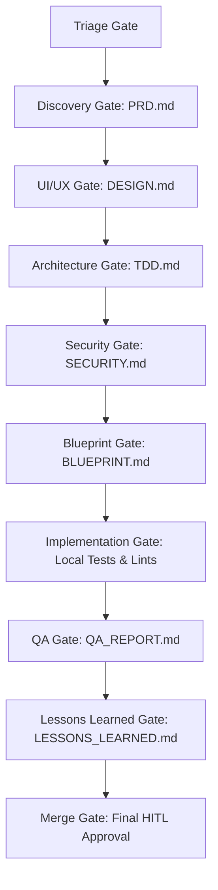

# PlainSightIL: Multi-Agent Orchestration System

This directory houses the active states, roles, custom playbooks (skills), and validation tools supporting the **PlainSightIL Multi-Agent SDLC Orchestration**.

---

## 📂 Directory Layout

```
.agents/
├── AGENTS.md        # Master framework configuration (roles, states, hitl gates)
├── bin/             # Git hooks installation script and linter/validation executables
├── state/           # Active issue states and phase-specific deliverables
│   ├── active_issues/
│   │   ├── issue_3.md
│   │   └── issue_4.md
│   └── issue_<id>/   # Deliverable directory (PRD.md, TDD.md, QA_REPORT.md, etc.)
└── skills/          # Agent-specific instruction playbooks
    ├── pm/          # Product Manager
    ├── ui_ux_designer/# UI/UX Designer
    ├── architect/   # System Architect
    ├── security/    # Security Engineer
    ├── tech_lead/   # Technical Lead
    ├── developer/   # Senior Developer
    ├── qa/          # QA Engineer
    └── lessons_learned/# Lessons Learned Agent
```

---

## 🔄 Lifecycle Transition Flow

Every issue (Feature, Bug, Refactor) transitions through a sequence of gated phases. Each phase is assigned to a specific agent role, and outputs a required artifact before moving to the next gate:



*Note: For details on Bug and Refactor custom lifecycles, refer to [AGENTS.md](file:///Users/abenzaken/Dev/PlainSightIL/.agents/AGENTS.md).*

---

## 📑 Active Issue Document Structure

Active issues are tracked in `.agents/state/active_issues/issue_<issue_id>.md`.
The file frontmatter contains the current issue state, which is parsed by agents to identify who should execute next:

```yaml
---
issue_id: 102
title: "Ingest and Integrate Active Cellular Antennas Dataset"
type: "feature"
current_phase: "implementation"
assigned_agent: "senior_developer"
status: "in-progress"
hitl_approval_required: false
hitl_approved_by: ""
---
```

### Transition Audit Logs
Agents must append transition log records directly to the active issue document under the `## 📋 Audit Log & Stage Transitions` section:
```markdown
## 📋 Audit Log & Stage Transitions
- **2026-06-01 22:25:00**: Issue created. Triaged and local issue tracking initialized.
- **2026-06-01 22:30:00**: Discovery phase complete. Generated PRD.md. Transitioned to ui_ux_design.
```

---

## 🤖 Guidelines for AI Agents

To ensure consistency and quality across autonomous developer cycles:

1.  **Read Playbook First**: Before performing tasks, read the playbook (SKILL.md) corresponding to your role in `.agents/skills/<role>/SKILL.md`.
2.  **Git Branch Convention**: Ensure you work in a branch prefixed by your issue id:
    *   Pattern: `(agents|dev)/<issue_id>-<description>`
    *   Example: `git checkout -b agents/102-cellular-antennas`
3.  **Deliverables Path**: Place all phase artifacts inside `.agents/state/issue_<issue_id>/` (e.g. `.agents/state/issue_102/PRD.md`).
4.  **HITL (Human-in-the-Loop) Gates**: If a phase transition has `hitl_gate: true` defined in `AGENTS.md` (e.g., Discovery, UI/UX Design, Security, and Merge Approval), you **must** stop and prompt the user. The transition is locked until the user sets `hitl_approved_by: "username"` in the issue frontmatter.
5.  **Log Transitions**: Upon completing your phase:
    *   Modify the active issue file frontmatter (change `current_phase` to the next phase, update `assigned_agent` to the next role, and toggle `hitl_approval_required` if the next phase requires a HITL gate).
    *   Add a line to the Audit Log section detailing your work.
