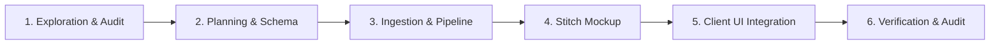
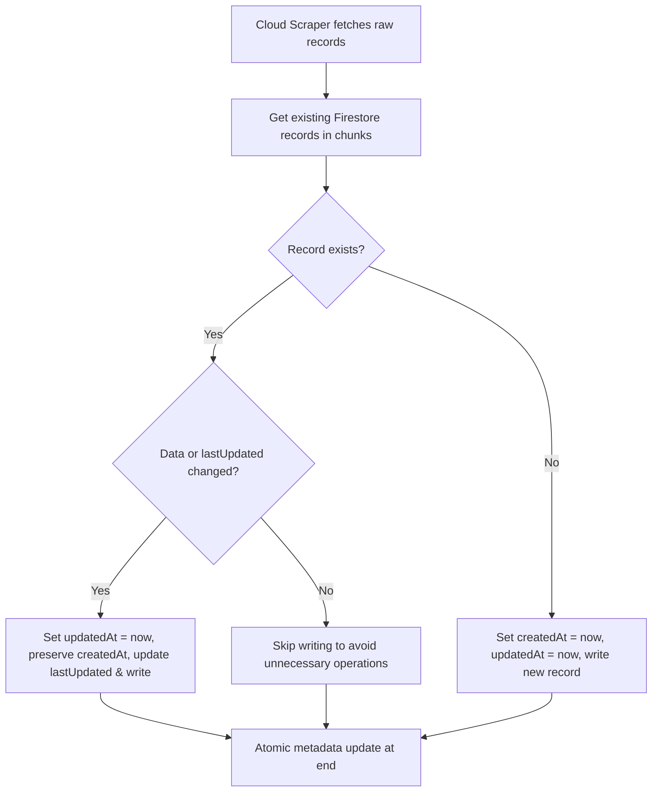

description: "Guidelines and checklist for integrating new datasets from data.gov.il into the PlainSightIL platform, utilizing an in-place update policy with a triple-timestamp schema (createdAt, updatedAt, and lastUpdated) to prevent redundant database writes."
---

# PlainSightIL: Dataset Integration Playbook

This playbook serves as the standard template and step-by-step engineering checklist for introducing any new public dataset from `data.gov.il` (or other official sources) into the **PlainSightIL** system.

---

## 1. Overview of the Ingestion & Visualization Lifecycle

Every dataset integration flows through five distinct phases:



---

## 2. Phase 1: Exploration & Audit

Before writing production code, perform a structured audit of the target dataset's distribution format.

### Step 1.1: Identify the Distribution Format
Open data portals typically distribute data in one of three ways:
1. **CKAN Datastore JSON API**: Direct pagination queries.
2. **Raw CSV Files**: Direct download of tabular data.
3. **Raw XLSX Files**: Excel sheets containing multiple sub-sheets or formatting styles.

### Step 1.2: Explore the Dataset Schema
Execute the appropriate check based on the file type:

* **For CKAN API**:
  ```bash
  curl -s "https://data.gov.il/api/3/action/datastore_search?resource_id=<DATASET_ID>&limit=5" | jq .
  ```
* **For Raw CSV / XLSX**:
  Download a small chunk or locate the resource URL from the CKAN package show API:
  ```bash
  # Retrieve resource URLs
  curl -s "https://data.gov.il/api/3/action/package_show?id=<PACKAGE_ID>" | jq '.result.resources[] | {format: .format, url: .url}'
  ```

### Step 1.3: Data Anatomy Audit
Answer the following questions:
* What is the distribution format (JSON API, CSV, XLSX)?
* What is the total volume of records?
* Are there geography fields? If yes:
  * Are coordinates in standard **WGS84** (Latitude/Longitude, e.g., `קו_רוחב`, `קו_אורך`)?
  * Or are they in the **Israel Transverse Mercator (ITM)** grid (EPSG:2039, e.g., `X_ITM`, `Y_ITM`)?
* What is the primary unique identifier for each record?

### Step 1.4: Translation Mapping Sheet
Create a local mapping sheet translating Hebrew keys to clean English CamelCase keys. Identify categorical strings that need dynamic English translation values in the database.

**Example Mapping Table:**
| Hebrew Key | Proposed English Key | Expected Data Type | Sample Value | Dynamic Translation Needed? |
| :--- | :--- | :--- | :--- | :--- |
| `ID` | `id` | `number` | `101` | No |
| `תאריך הגשת הבקשה` | `submissionDate` | `string (ISO)` | `"2025-09-01T00:00:00.000Z"` | No |
| `חברה` | `company` | `object` | `{ he: "סלקום", en: "Cellcom" }` | Yes |
| `קו_רוחב` / `X_ITM` | `latitude` / `xItm` | `number` | `32.0853` / `184770` | No |

---

## 3. Phase 2: Planning & Schema Design (Zero-Downtime Architecture)

### Step 2.0: Naming & Directory Structure Conventions

To maintain a clean, scalable codebase and prevent naming confusion:

#### 1. Database Collection & Document Naming
* **Firestore Collections**: All raw dataset collections MUST be named using their unique resource GUID (e.g., `8935c8e5-ec77-421f-af86-d970583195f8`).
* **Metadata Documents**: In the `dataset_metadata` collection, each document ID representing a dataset's metadata MUST be the exact resource GUID (e.g., `8935c8e5-ec77-421f-af86-d970583195f8`).

#### 2. Client-side Code Directory Layout
All dataset-specific presentation widgets, screens, and models MUST be structured within a unified `features/datasets` folder:

```
client/lib/features/datasets/
└── <dataset_name>/
    ├── data/
    │   └── models/
    │       └── <dataset_name>_record_model.dart  (If a custom model is required)
    ├── pages/
    │   └── <dataset_name>_page.dart              (Main entry page for the dataset screen)
    └── widgets/
        └── <dataset_name>_map_view.dart          (Visualizer widgets specific to the page)
```

#### 3. Test File Layout
Widget tests corresponding to visualizer screens must be located in a matching structure under `test/`:
```
client/test/features/datasets/
└── <dataset_name>/
    └── pages/
        └── <dataset_name>_page_test.dart
```

#### 4. General Catalog Directory
The general list catalog/search screen (where all datasets are displayed together) is a distinct catalog feature and must remain under `features/directory/` (e.g. `DatasetDirectoryScreen`, `DatasetCard`, `DatasetMetadataModel`).

### Step 2.1: The Ingestion Metadata Schema

To support dataset refreshes efficiently and create alerts on records that are new or updated, we implement an **In-place Update Policy with a Triple-Timestamp Schema** at the database level.



### Step 2.1: The Ingestion Metadata Schema
Create a central collection `dataset_metadata` in Firestore containing pointers and statuses for all datasets:

```typescript
// Document ID: resource GUID (e.g. "ff398c7e-c522-4ee8-a53a-312b188a573d")
export interface DatasetMetadata {
  id: string;                    // e.g. "ff398c7e-c522-4ee8-a53a-312b188a573d"
  activeCollection: string;      // e.g. "ff398c7e-c522-4ee8-a53a-312b188a573d"
  lastUpdated: string;           // ISO timestamp of last successful sync
  recordCount: number;           // Total count of records imported
  status: "idle" | "syncing" | "error";
}
```

### Step 2.2: Collection Setup
Define a collection for your dataset named exactly after the resource GUID (e.g., `<resource_guid>`). The documents must use the triple-timestamp schema:

```typescript
export interface NormalizedDatasetRecord {
  id: string;                         
  coordinates: admin.firestore.GeoPoint; 
  geohash: string;                    
  createdAt: string;                  // ISO timestamp of first document ingestion
  updatedAt: string;                  // ISO timestamp of database document modification
  lastUpdated: string;                // ISO timestamp of source metadata last modification
  
  // Dynamic translations are embedded in data structures
  company: {
    he: string;
    en: string;
  };
  
  // Custom Domain Specific Fields:
  [englishKey: string]: any;
}
```

### Step 2.3: Security Rules Setup
Modify `backend/firestore.rules` to authorize reads on the collection and restrict list sizes:
```javascript
match /dataset_metadata/{datasetId} {
  allow read: if true;
  allow write: if false;
}
match /<resource_guid>/{docId} {
  allow read: if true;
  allow write: if false;
  // Prevent scraping abuse (DoS) by enforcing query limits
  allow list: if request.query.limit <= 100;
}
```

### Step 2.4: Composite Query Indexing
Apply indexes to the collection in `backend/firestore.indexes.json`:
```json
[
  {
    "collectionGroup": "<resource_guid>",
    "queryScope": "COLLECTION",
    "fields": [
      { "fieldPath": "company.en", "order": "ASCENDING" },
      { "fieldPath": "geohash", "order": "ASCENDING" }
    ]
  }
]
```
```

---

## 4. Phase 3: Ingestion & Pipeline Implementation

Write the data sync script, file parser, coordinate projection logic, and cloud triggers.

### Step 4.1: Install Parser Dependencies
Depending on the source file format, install the required packages in `backend/functions`:

* **For CSV Parsing**: Install `csv-parse` for memory-efficient streaming:
  ```bash
  npm --prefix backend/functions install csv-parse
  ```
* **For XLSX Parsing**: Install `xlsx` (SheetJS) to extract tabular grids from sheets (ensure Cloud Function is provisioned with >= 1GB RAM if Excel is unavoidable):
  ```bash
  npm --prefix backend/functions install xlsx
  ```

### Step 4.2: Ingestion & In-Place Pipeline Implementation

For detailed, reusable code implementations covering:
- **ITM Coordinate Conversion**: Coordinate projection converting Israel grid to WGS84 GPS.
- **Ingestion Patterns**: CKAN JSON search, CSV streams, Excel XLSX parsing.
- **Triple Timestamp Updates**: Firestore write logic protecting document creation and updates.

Reference the official template: [dataset_ingestion_template.ts](file:///Users/abenzaken/Dev/PlainSightIL/docs/templates/dataset_ingestion_template.ts).

---

## 5. Phase 4: Stitch UI Mockup & Client UI Integration

To guarantee design system alignment and visualize bidirectional layouts before writing code, we leverage the **Stitch** design workspace.

### Step 5.0: Generate & Sync Screen Layouts in Stitch
Before writing Dart widgets, use **StitchMCP** to generate high-fidelity mobile mockups for both English (LTR) and Hebrew (RTL) views of the target dataset.

* **Tool to call:** `generate_screen_from_text`
* **Project ID:** Retrieve via project metadata (e.g. `10303868738682079846`).
* **Design System ID:** Must specify the project's active design system asset (e.g. `assets/c8f9ae9df49d4ac4a8306656d732a633`).
* **Prompt Engineering for Dataset Screens:**
  The generation prompt should explicitly mandate:
  1. **Visual Theme:** Slate Dark Mode, HSL-based palette, glassmorphism elements (back-drop blurs, 1px white border with 8% opacity).
  2. **Geometry:** Mobile-first, bottom third touch layout, minimum touch target size of 48x48px.
  3. **Visualizer Area:** SVG/Canvas layout for map pins or water levels.
  4. **Dynamic Bottom Sheet:** Filter input controls (search locality/ID), toggle sliders, and detailed cards with semantic-colored borders.
  5. **Bidirectional Support:** Force mirroring using CSS logical properties and Assistant/Outfit typographic rules.

* **Documentation Sign-off:** After successful generation, extract the Stitch screen IDs and create a design specification file (e.g. `docs/design_<dataset_name>.md`) detailing the layout grid, colors, fonts, and interaction states for the implementation.

### Step 5.1: Double Subscription Buffering & Viewport Rendering

For detailed, reusable client implementations covering:
- **Double Subscription Buffering**: Dynamic active collection swaps in state notifier to prevent UI flickering.
- **Virtualized Lists & Shimmers**: Gesture conflict prevention, shimmers, and semantic descriptions.

Reference the official template: [dataset_view_template.dart](file:///Users/abenzaken/Dev/PlainSightIL/docs/templates/dataset_view_template.dart).

---

## 6. Phase 5: Verification & Non-Functional Compliance

Verify correctness, performance boundaries, and offline robustness.

### Step 6.1: Automated Pipelines
* Run backend linter and tests:
  ```bash
  npm --prefix backend/functions run lint
  ```
* Run Vitest mocks verifying parser behaviors under corrupted inputs and verifying coordinate projection outputs within range limits:
  ```bash
  npm --prefix backend/functions run test
  ```

### Step 6.2: Non-Functional Audit Checklist
* [ ] **Touch Target Size**: Ensure all interactive buttons, list-items, and chip selectors measures at least 48x48px.
* [ ] **Bilingual Mirroring (RTL/LTR)**: Switch locales and check for overflow flags, proper text alignment, and reversed row directions.
* [ ] **Flicker-Free Ingest Verification**: Trigger a mock dataset ingestion and verify client elements remain visible and transitions cross-fade seamlessly during active collection swaps.
* [ ] **Offline Persistence Checks**: Disable internet connection and verify cached records load instantly.
