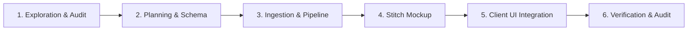
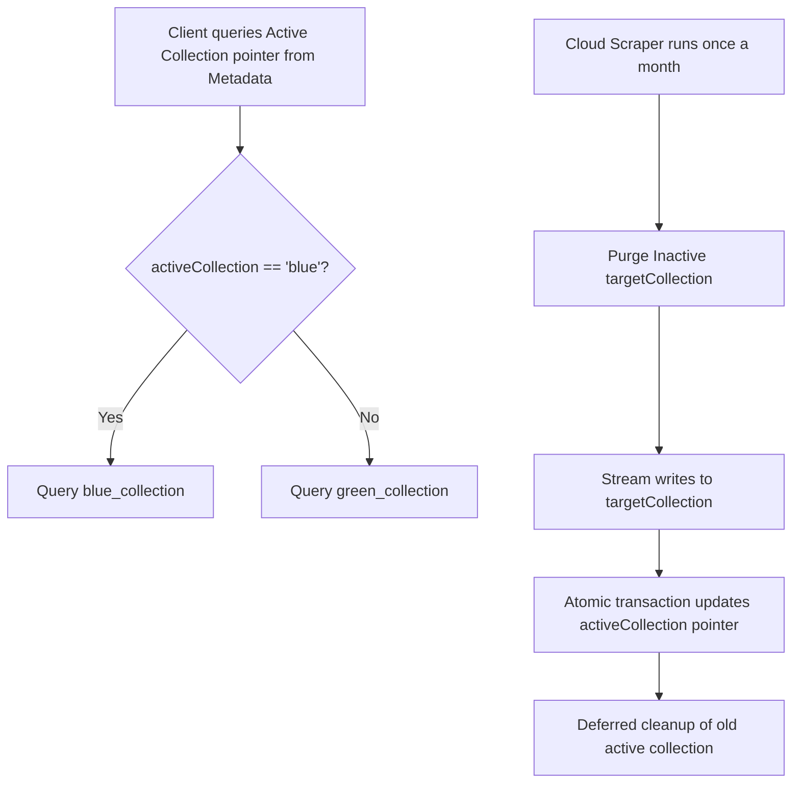

# PlainSightIL: Dataset Integration Playbook

This playbook serves as the standard template and step-by-step engineering checklist for introducing any new public dataset from `data.gov.il` (or other official sources) into the **PlainSightIL** system.

---

## 1. Overview of the Ingestion & Visualization Lifecycle

Every dataset integration flows through five distinct phases:



---

## 2. Phase 1: Exploration & Audit

Before writing production code, perform a structured audit of the target dataset's distribution format.

### Step 1.1: Identify the Distribution Format
Open data portals typically distribute data in one of three ways:
1. **CKAN Datastore JSON API**: Direct pagination queries.
2. **Raw CSV Files**: Direct download of tabular data.
3. **Raw XLSX Files**: Excel sheets containing multiple sub-sheets or formatting styles.

### Step 1.2: Explore the Dataset Schema
Execute the appropriate check based on the file type:

* **For CKAN API**:
  ```bash
  curl -s "https://data.gov.il/api/3/action/datastore_search?resource_id=<DATASET_ID>&limit=5" | jq .
  ```
* **For Raw CSV / XLSX**:
  Download a small chunk or locate the resource URL from the CKAN package show API:
  ```bash
  # Retrieve resource URLs
  curl -s "https://data.gov.il/api/3/action/package_show?id=<PACKAGE_ID>" | jq '.result.resources[] | {format: .format, url: .url}'
  ```

### Step 1.3: Data Anatomy Audit
Answer the following questions:
* What is the distribution format (JSON API, CSV, XLSX)?
* What is the total volume of records?
* Are there geography fields? If yes:
  * Are coordinates in standard **WGS84** (Latitude/Longitude, e.g., `קו_רוחב`, `קו_אורך`)?
  * Or are they in the **Israel Transverse Mercator (ITM)** grid (EPSG:2039, e.g., `X_ITM`, `Y_ITM`)?
* What is the primary unique identifier for each record?

### Step 1.4: Translation Mapping Sheet
Create a local mapping sheet translating Hebrew keys to clean English CamelCase keys. Identify categorical strings that need dynamic English translation values in the database.

**Example Mapping Table:**
| Hebrew Key | Proposed English Key | Expected Data Type | Sample Value | Dynamic Translation Needed? |
| :--- | :--- | :--- | :--- | :--- |
| `ID` | `id` | `number` | `101` | No |
| `תאריך הגשת הבקשה` | `submissionDate` | `string (ISO)` | `"2025-09-01T00:00:00.000Z"` | No |
| `חברה` | `company` | `object` | `{ he: "סלקום", en: "Cellcom" }` | Yes |
| `קו_רוחב` / `X_ITM` | `latitude` / `xItm` | `number` | `32.0853` / `184770` | No |

---

## 3. Phase 2: Planning & Schema Design (Zero-Downtime Architecture)

To support monthly dataset refreshes without causing UI downtime or displaying partially updated (inconsistent) states to users, we implement a **Blue-Green Ingestion (Double Buffering) Pattern** at the database level.



### Step 2.1: The Ingestion Metadata Schema
Create a central collection `dataset_metadata` in Firestore containing pointers to the current active partitions:

```typescript
// Document ID: dataset_id (e.g. "cellular_permit_applications")
export interface DatasetMetadata {
  id: string;                    // e.g. "cellular_permit_applications"
  activeCollection: string;      // e.g. "permit_apps_blue" or "permit_apps_green"
  lastUpdated: string;           // ISO timestamp of last successful sync
  recordCount: number;           // Total count of records imported
  status: "idle" | "syncing" | "error";
}
```

### Step 2.2: Dual Collections Setup
Define two collections for your dataset (e.g., `<dataset_name>_blue` and `<dataset_name>_green`). Both must share identical schemas:

```typescript
export interface NormalizedDatasetRecord {
  id: string;                         
  coordinates: admin.firestore.GeoPoint; 
  geohash: string;                    
  lastUpdated: string;                
  
  // Dynamic translations are embedded in data structures
  company: {
    he: string;
    en: string;
  };
  
  // Custom Domain Specific Fields:
  [englishKey: string]: any;
}
```

### Step 2.3: Security Rules Setup
Modify `backend/firestore.rules` to authorize reads on both color partitions and restrict list sizes:
```javascript
match /dataset_metadata/{datasetId} {
  allow read: if true;
  allow write: if false;
}
match /<dataset_name>_blue/{docId} {
  allow read: if true;
  allow write: if false;
  // Prevent scraping abuse (DoS) by enforcing query limits
  allow list: if request.query.limit <= 100;
}
match /<dataset_name>_green/{docId} {
  allow read: if true;
  allow write: if false;
  allow list: if request.query.limit <= 100;
}
```

### Step 2.4: Composite Query Indexing
Apply indexes to both collections in `backend/firestore.indexes.json`:
```json
[
  {
    "collectionGroup": "<dataset_name>_blue",
    "queryScope": "COLLECTION",
    "fields": [
      { "fieldPath": "company.en", "order": "ASCENDING" },
      { "fieldPath": "geohash", "order": "ASCENDING" }
    ]
  },
  {
    "collectionGroup": "<dataset_name>_green",
    "queryScope": "COLLECTION",
    "fields": [
      { "fieldPath": "company.en", "order": "ASCENDING" },
      { "fieldPath": "geohash", "order": "ASCENDING" }
    ]
  }
]
```

---

## 4. Phase 3: Ingestion & Pipeline Implementation

Write the data sync script, file parser, coordinate projection logic, and cloud triggers.

### Step 4.1: Install Parser Dependencies
Depending on the source file format, install the required packages in `backend/functions`:

* **For CSV Parsing**: Install `csv-parse` for memory-efficient streaming:
  ```bash
  npm --prefix backend/functions install csv-parse
  ```
* **For XLSX Parsing**: Install `xlsx` (SheetJS) to extract tabular grids from sheets (ensure Cloud Function is provisioned with >= 1GB RAM if Excel is unavoidable):
  ```bash
  npm --prefix backend/functions install xlsx
  ```

### Step 4.2: Pre-compiled Coordinate Conversion
If coordinates are in the **ITM (Israel Transverse Mercator)** system, use `proj4` pre-compiled at the module level to reduce calculations execution times by over 10x:

```typescript
import proj4 from "proj4";

proj4.defs("EPSG:2039", "+proj=tmerc +lat_0=31.73439361111111 +lon_0=35.20451694444445 +k=1.0000067 +x_0=219529.584 +y_0=626907.39 +ellps=GRS80 +towgs84=-48,55,52,0,0,0,0 +units=m +no_defs");

// Pre-compiled projection converter compiled once on load
const itmToWgs84Converter = proj4("EPSG:2039", "EPSG:4326");

export function convertItmToWgs84(xItm: number, yItm: number): { latitude: number, longitude: number } {
  const [longitude, latitude] = itmToWgs84Converter.forward([xItm, yItm]);
  return { latitude, longitude };
}

// Validation boundaries checks
export function isValidIsraelCoordinates(latitude: number, longitude: number): boolean {
  return (
    latitude >= 29.3 && latitude <= 33.4 &&
    longitude >= 34.2 && longitude <= 35.9
  );
}
```

### Step 4.3: Parsing Implementation Models

Choose the parsing template matching the dataset file type, utilizing streams for large tables:

#### Pattern A: CKAN API Recursive Paginated Scraper
```typescript
import axios from "axios";

async function fetchAllFromCkanApi(resourceId: string, onBatchFetched: (records: any[]) => Promise<void>): Promise<void> {
  let offset = 0;
  const limit = 1000;
  let hasMore = true;

  while (hasMore) {
    const url = `https://data.gov.il/api/3/action/datastore_search?resource_id=${resourceId}&limit=${limit}&offset=${offset}`;
    const response = await axios.get(url);
    const records = response.data?.result?.records ?? [];
    
    if (records.length === 0) {
      hasMore = false;
      break;
    }
    
    await onBatchFetched(records);
    offset += limit;
  }
}
```

#### Pattern B: Streaming CSV Ingestion (OOM Safe)
```typescript
import axios from "axios";
import { parse } from "csv-parse";

async function streamAndProcessCsv(csvUrl: string, processRecord: (record: any) => Promise<void>): Promise<void> {
  const response = await axios.get(csvUrl, { responseType: "stream" });
  const parser = response.data.pipe(parse({
    columns: true,
    skip_empty_lines: true,
    trim: true,
  }));

  for await (const record of parser) {
    await processRecord(record);
  }
}
```

#### Pattern C: Excel XLSX Parsing
```typescript
import axios from "axios";
import * as XLSX from "xlsx";

async function fetchAndParseXlsx(xlsxUrl: string): Promise<any[]> {
  const response = await axios.get(xlsxUrl, { responseType: "arraybuffer" });
  const workbook = XLSX.read(response.data, { type: "buffer" });
  const firstSheetName = workbook.SheetNames[0];
  const worksheet = workbook.Sheets[firstSheetName];
  return XLSX.utils.sheet_to_json(worksheet);
}
```

### Step 4.4: Ingestion Pipeline with Buffer Cleansing
Purge target collections prior to loading to avoid dirty/partial leftovers, and run chunked bulk writes:

```typescript
import * as admin from "firebase-admin";
import { logger } from "firebase-functions";
import { encodeGeohash } from "../utils/geohash";

// Dynamic translation map example
const CATEGORY_TRANSLATIONS: Record<string, Record<string, string>> = {
  "חברה": {
    "סלקום": "Cellcom",
    "פלאפון": "Pelephone",
    "פרטנר": "Partner",
    "הוט מובייל": "HOT Mobile"
  }
};

function getTranslatedField(category: string, rawValue: string): { he: string; en: string } {
  const normalizedValue = rawValue.trim();
  const enValue = CATEGORY_TRANSLATIONS[category]?.[normalizedValue] ?? normalizedValue;
  return { he: normalizedValue, en: enValue };
}

export async function scrapeAndSyncDataset(db: admin.firestore.Firestore): Promise<{ count: number }> {
  const datasetId = "cellular_permit_applications";
  const metadataRef = db.collection("dataset_metadata").doc(datasetId);

  try {
    // 1. Fetch current active partition
    const metaDoc = await metadataRef.get();
    const currentActive = metaDoc.exists ? metaDoc.data()?.activeCollection : null;
    
    const targetCollectionName = currentActive === "<dataset_name>_blue" 
      ? "<dataset_name>_green" 
      : "<dataset_name>_blue";
      
    logger.info(`Sync starting. Target buffer collection: ${targetCollectionName}`);

    // 2. Unconditionally Purge Inactive Collection before Ingestion starts
    await purgeCollection(db, targetCollectionName);
    logger.info(`Purged target buffer collection: ${targetCollectionName}`);

    // 3. Process Stream / Ingest
    let processedCount = 0;
    let batch = db.batch();
    const collectionRef = db.collection(targetCollectionName);

    await streamAndProcessCsv("<CSV_URL>", async (record) => {
      // Clean and sanitize PII fields if present
      delete record.owner_phone_number;

      const normalizedId = String(record.ID ?? record.id);
      let lat = parseFloat(record.latitude);
      let lng = parseFloat(record.longitude);

      // Coordinate converter boundary sanitization
      if (!isNaN(lat) && !isNaN(lng) && isValidIsraelCoordinates(lat, lng)) {
        const geohash = encodeGeohash(lat, lng);
        const docData = {
          id: normalizedId,
          coordinates: new admin.firestore.GeoPoint(lat, lng),
          geohash,
          lastUpdated: new Date().toISOString(),
          company: getTranslatedField("חברה", record.company),
        };

        const docRef = collectionRef.doc(normalizedId);
        batch.set(docRef, docData);
        processedCount++;

        if (processedCount % 500 === 0) {
          await batch.commit();
          batch = db.batch();
        }
      }
    });

    if (processedCount % 500 !== 0) {
      await batch.commit();
    }

    // 4. Atomic Switch of activeCollection metadata pointer
    await metadataRef.set({
      id: datasetId,
      activeCollection: targetCollectionName,
      lastUpdated: new Date().toISOString(),
      recordCount: processedCount,
      status: "idle"
    }, { merge: true });

    logger.info(`Swapped active pointer to ${targetCollectionName}. Ingestion complete.`);
    return { count: processedCount };
  } catch (error) {
    logger.error("Sync failed:", error);
    await metadataRef.set({ status: "error" }, { merge: true });
    throw error;
  }
}

async function purgeCollection(db: admin.firestore.Firestore, collectionPath: string) {
  const collectionRef = db.collection(collectionPath);
  const snapshot = await collectionRef.limit(500).get();
  
  if (snapshot.size === 0) return;
  
  const batch = db.batch();
  snapshot.docs.forEach((doc) => batch.delete(doc.ref));
  await batch.commit();
  
  // Recurse until empty
  await purgeCollection(db, collectionPath);
}
```

---

## 5. Phase 4: Stitch UI Mockup & Client UI Integration

To guarantee design system alignment and visualize bidirectional layouts before writing code, we leverage the **Stitch** design workspace.

### Step 5.0: Generate & Sync Screen Layouts in Stitch
Before writing Dart widgets, use **StitchMCP** to generate high-fidelity mobile mockups for both English (LTR) and Hebrew (RTL) views of the target dataset.

* **Tool to call:** `generate_screen_from_text`
* **Project ID:** Retrieve via project metadata (e.g. `10303868738682079846`).
* **Design System ID:** Must specify the project's active design system asset (e.g. `assets/c8f9ae9df49d4ac4a8306656d732a633`).
* **Prompt Engineering for Dataset Screens:**
  The generation prompt should explicitly mandate:
  1. **Visual Theme:** Slate Dark Mode, HSL-based palette, glassmorphism elements (back-drop blurs, 1px white border with 8% opacity).
  2. **Geometry:** Mobile-first, bottom third touch layout, minimum touch target size of 48x48px.
  3. **Visualizer Area:** SVG/Canvas layout for map pins or water levels.
  4. **Dynamic Bottom Sheet:** Filter input controls (search locality/ID), toggle sliders, and detailed cards with semantic-colored borders.
  5. **Bidirectional Support:** Force mirroring using CSS logical properties and Assistant/Outfit typographic rules.

* **Documentation Sign-off:** After successful generation, extract the Stitch screen IDs and create a design specification file (e.g. `docs/design_<dataset_name>.md`) detailing the layout grid, colors, fonts, and interaction states for the implementation.

### Step 5.1: Double Subscription Buffering in AppState
AppState buffers dynamic switches inside the notifier:

```dart
import 'dart:async';
import 'package:flutter/material.dart';
import 'package:cloud_firestore/cloud_firestore.dart';

class AppStateNotifier extends ChangeNotifier {
  String _activeCollectionName = '';
  List<DocumentSnapshot> _cachedRecords = [];
  StreamSubscription<QuerySnapshot>? _activeSubscription;
  bool _isLoading = true;
  String _syncStatus = 'idle';

  List<DocumentSnapshot> get cachedRecords => _cachedRecords;
  bool get isLoading => _isLoading;
  String get syncStatus => _syncStatus;

  void initMetadataListener() {
    FirebaseFirestore.instance
        .collection('dataset_metadata')
        .doc('cellular_permit_applications')
        .snapshots()
        .listen((metaSnapshot) {
      if (metaSnapshot.exists && metaSnapshot.data() != null) {
        final newActive = metaSnapshot.data()!['activeCollection'] as String;
        _syncStatus = metaSnapshot.data()!['status'] as String? ?? 'idle';
        
        if (newActive != _activeCollectionName) {
          _bindActiveCollection(newActive);
        } else {
          notifyListeners();
        }
      }
    });
  }

  void _bindActiveCollection(String newCollection) {
    _activeCollectionName = newCollection;
    
    // Create new stream subscription
    final newStream = FirebaseFirestore.instance.collection(newCollection).snapshots();
    
    StreamSubscription<QuerySnapshot>? newSubscription;
    newSubscription = newStream.listen((snapshot) {
      // Swap collection contents only when data resolves (Zero Visual Flickering)
      _cachedRecords = snapshot.docs;
      _isLoading = false;
      notifyListeners();
      
      // Cleanup previous subscription references
      _activeSubscription?.cancel();
      _activeSubscription = newSubscription;
    });
  }
  
  @override
  void dispose() {
    _activeSubscription?.cancel();
    super.dispose();
  }
}
```

### Step 5.2: Screen rendering with Virtualization & Shimmers
Renders UI using viewport widgets:
* **a11y and Touch Targets**: Add screen-reader labels to icons and pins using `Semantics` descriptors and guarantee touch buttons measure >= 48x48px.
* **Avoid Gesture Conflicts**: Wrap bottom sheets in a `DraggableScrollableSheet` with `ListView.builder` connected to the sheet's controller.
* **Marker Clustering**: Limit active pins via range queries, clustering any count exceeds 100.
* **Premium Shimmer Screen**: Replace white spinners with HSL styled skeletons.

```dart
@override
Widget build(BuildContext context) {
  final appState = Provider.of<AppStateNotifier>(context);

  if (appState.isLoading && appState.cachedRecords.isEmpty) {
    return const GlassmorphicCardSkeletonList(); // Styled skeletal loader
  }

  return Column(
    children: [
      if (appState.syncStatus == 'error')
        const DataSyncErrorWarningBanner(),
        
      Expanded(
        child: DraggableScrollableSheet(
          builder: (context, scrollController) {
            return GlassmorphicCard(
              child: ListView.builder(
                controller: scrollController, // Prevents mobile gesture drag conflicts
                itemCount: appState.cachedRecords.length,
                itemBuilder: (context, index) {
                  final record = appState.cachedRecords[index].data() as Map<String, dynamic>;
                  return Semantics(
                    label: "Application at ${record['address']}",
                    child: VisualCardItem(data: record),
                  );
                },
              ),
            );
          },
        ),
      ),
    ],
  );
}
```

---

## 6. Phase 5: Verification & Non-Functional Compliance

Verify correctness, performance boundaries, and offline robustness.

### Step 6.1: Automated Pipelines
* Run backend linter and tests:
  ```bash
  npm --prefix backend/functions run lint
  ```
* Run Vitest mocks verifying parser behaviors under corrupted inputs and verifying coordinate projection outputs within range limits:
  ```bash
  npm --prefix backend/functions run test
  ```

### Step 6.2: Non-Functional Audit Checklist
* [ ] **Touch Target Size**: Ensure all interactive buttons, list-items, and chip selectors measures at least 48x48px.
* [ ] **Bilingual Mirroring (RTL/LTR)**: Switch locales and check for overflow flags, proper text alignment, and reversed row directions.
* [ ] **Flicker-Free Ingest Verification**: Trigger a mock dataset ingestion and verify client elements remain visible and transitions cross-fade seamlessly during active collection swaps.
* [ ] **Offline Persistence Checks**: Disable internet connection and verify cached records load instantly.
