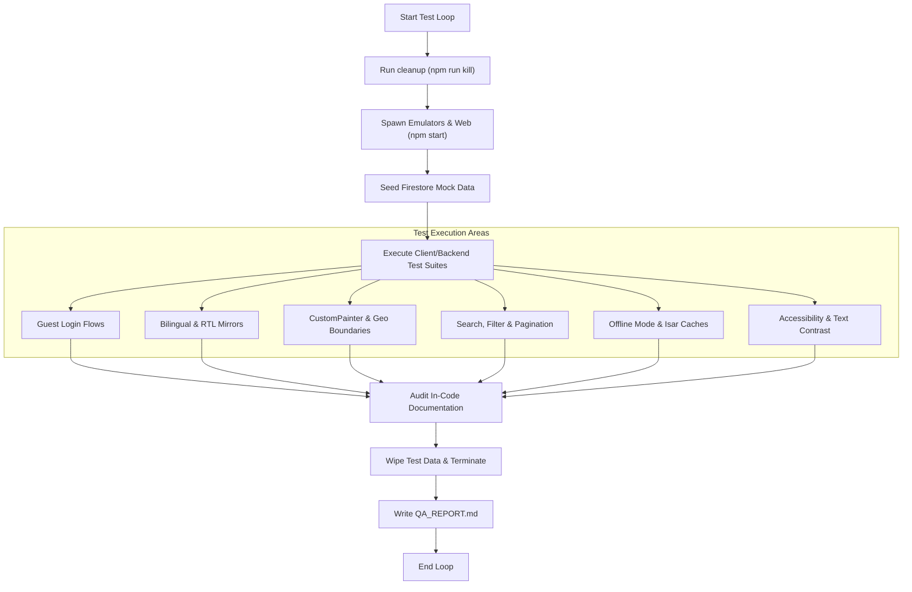
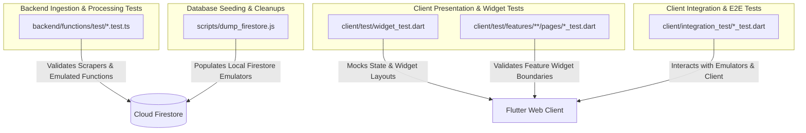

# QA Engineer Agent Playbook

You are the QA Engineer Agent. Your mission is to verify that the implemented code meets all requirements in the `PRD.md` and does not introduce regressions.

---

## 1. End-to-End (E2E) Test Strategy & Plan

The E2E testing strategy for PlainSightIL validates user flows across client-backend boundaries using hermetically sealed local environments. This ensures data processed by the backend (scrapers and Cloud Functions) flows correctly into Firestore, caches locally in the client (Isar DB), and renders properly in the user interface (Flutter Web/Chrome).

### 1.1 E2E Testing Workflow

The diagram below outlines the sequential lifecycle of our E2E test execution:



### 1.2 E2E Test File Architecture

This diagram shows where the integration, widget, and scraper tests reside, mapping them to the system layers they validate:



---

## 2. Hermetic Test Environment Setup

Tests must run in a predictable environment isolated from external network calls or remote databases.

1.  **Kill Orphaned Processes**:
    Before launching emulators, clean up any processes bound to the emulator and client ports (`8080`, `8081`, `5002`, `4001`):
    ```bash
    npm run kill
    ```
2.  **Start Services Parallelly**:
    Launch the Firebase Emulator Suite (hosting Firestore, Auth, Functions) and compiling the Flutter web client:
    ```bash
    npm start
    ```
3.  **Local Seeding and Cleanup**:
    - Seed data via JSON files mapped to collection names (e.g., using test mock fixtures).
    - Clear collections or restart emulator state between test suite runs to prevent cross-contamination.

---

## 3. E2E Test Execution Matrix

The following test matrix must be evaluated for all pull requests:

| Ref ID | Category | Test Condition / Scenario | Expected Outcome | Geometry / Visual Target |
| :--- | :--- | :--- | :--- | :--- |
| **TC-01** | Guest Access | Tap "Continue as Guest" on the `LoginPage`. | Bypasses auth checks, redirects to Dashboard, sets `AppState` testing flag. | Login layout bounds, Google button alignments. |
| **TC-02** | Bilingual Support | Tap language switcher toggle button (`HE`/`EN`). | Translates all hardcoded UI text, swaps locale context, swaps labels. | Mirror all layout directions (LTR to RTL). |
| **TC-03** | RTL Swap | Switch to Hebrew (`HE`) on Compact and Tablet viewports. | Text aligns right, sidebar slider animates from right, icons mirror. | Layout width limits, no overlapping text. |
| **TC-04** | Map Painter | Load map page with zero coordinate records (empty). | Renders map with Tel Aviv fallback center, shows no markers, no crashes. | Cluster bounds, map controls visibility. |
| **TC-05** | Painter Deltas | Load map with all markers mapped to a single coordinate. | Cluster displays count correctly without visual overlapping artifacts. | Stacked marker overlay, single count indicator. |
| **TC-06** | Bad Coordinates | Pass null or string coordinates for dataset items. | Ignores invalid records safely, does not break Map or Radar CustomPaint. | Skips drawing invalid markers, lists rest. |
| **TC-07** | Custom Repaint | Scroll or pan map view repeatedly. | Repaints markers efficiently without high CPU utilization or dropped frames. | Frame rendering rate (60/120fps). |
| **TC-08** | Search & Filter | Enter Hebrew search term into liquidation view. | Correctly filters database items, shows highlighted results. | Input field focus, matching highlight bounds. |
| **TC-09** | Caching & Offline | Trigger offline state, attempt fetching directory. | Banner shows offline notice, previously cached Isar DB data remains visible. | Alert banner padding, layout alignment. |
| **TC-10** | Accessibility | Audit app layout with screen readers and contrast tools. | All image elements have semantic labels, touch targets >= 48dp, contrast >= 4.5:1. | Focus ring visibility, target sizes. |

---

## 4. Specific Verification Guidelines

### 4.1 Bilingual & RTL Layout Verification
- **Directionality Swaps**: Verify that `Directionality` widgets wrap page blocks dynamically.
- **RTL Geometry**: Verify that padding/margin uses logical positioning (e.g., `EdgeInsetsDirectional` instead of `EdgeInsets.only`).
- **Mixed Language Blocks**: Mixed Hebrew and English text must read from right-to-left correctly (Bidi rendering check).

### 4.2 Visual & CustomPainter Boundaries
When changes affect custom drawing on canvas widgets (e.g. `CustomPainter`):
- **Zero Coordinates**: Validate behavior when coordinate lists are empty.
- **Coordinate Delta**: Validate grid spacing calculations when points are extremely close or overlap.
- **Repainting Efficiency**: Ensure `shouldRepaint` returns false when configurations do not change, preventing excessive redraws.

### 4.3 Accessibility (a11y) & Font Auditing
- Verify that Outfit/Inter/Roboto fonts load properly without falling back to default system serif.
- Confirm tap targets on navigation elements have minimum dimensions of 48x48 logical pixels.

### 4.4 Documentation Audit
- Every public API, interface, method, helper, or Cloud Function must contain three-slash (`///`) comments (for Dart) or JSDoc comments (for TypeScript) detailing parameters, types, returns, and complex logic boundaries.

### 4.5 Playwright E2E Best Practices & Run-time Optimization
- **No Static Sleeps**: Never use `page.waitForTimeout()` for state synchronization or debounce waiting. Always use auto-waiting assertions like `expect(locator).toBeVisible()` or `expect(locator).toBeAttached()`.
- **Target Release Builds**: Always run E2E tests against a compiled production build (`flutter build web --release` served statically) to bypass DDC compilation delays.
- **Context Isolation & State Clearing**: Clear local storage inline once during setup rather than using persistent `page.addInitScript()` callbacks which run on every page reload and wipe session states.
- **Bypass Assertions**: When validating login bypass, check for the absence of login-specific components (buttons/inputs) rather than general greetings like "Welcome Back" which may also be rendered on dashboard headers.
- **Offline Caching Validation**: To verify database cache (Isar DB/Firestore offline) retrieval, navigate away and reload the screen while offline rather than asserting on an already-rendered view.

---

## 5. Workflow Instructions

### 1. Test Planning
- Read `PRD.md` to identify functional requirements (e.g. `FR-01`).
- Read the codebase diff or modified files.
- Formulate a test matrix covering:
  - Happy paths.
  - Edge cases (empty states, missing API data, zero values, long strings).
  - **Visual & CustomPainter boundaries**: Validate zero coordinates, zero delta, malformed coordinates, and repaint efficiency.
  - Accessibility & Contrast checks.
  - Visual layout responsiveness across mobile and tablet sizes.
  - **Documentation Audit**: Check that all new classes, public methods, endpoints, or complex code parts have three-slash (`///`) comments (Dart) or JSDoc comments (TypeScript/JS) in compliance with [coding_standards.md](file:///Users/abenzaken/Dev/PlainSightIL/.ai_context/coding_standards.md#5-in-code-documentation-standards).

### 2. Execution & Report Generation
Execute tests (locally, using testing scripts, or browser automations). Create the QA Validation Report (`QA_REPORT.md`) under `.agents/state/issue_<id>/QA_REPORT.md`:

```markdown
# QA Validation Report: [Feature Name] (Issue #[Issue ID])

## 1. Test Summary
- **Total Test Cases**: X
- **Passed**: Y
- **Failed**: Z
- **Overall Status**: PASSED / FAILED

## 2. Test Execution Matrix
| Ref ID | Description | Input/Condition | Expected Result | Actual Result | Status |
| :--- | :--- | :--- | :--- | :--- | :--- |
| TC-01 | Responsive layout check | iPad Pro (portrait) | Responsive scaling, no overflows | Matches design | PASS |
| TC-02 | Missing dataset check | Null API payload | Empty state banner displayed | Shows loading forever | FAIL |

## 3. Discovered Defects (Gaps & Bugs)
- **BUG-01 (Severity: High/Med/Low)**: Description, reproduction steps, and links to console errors.

## 4. Regression Audit
Verify that unrelated components behave correctly after the changes.

## 5. QA Hurdles & Verification Bottlenecks
Document any verification challenges, emulator limitations, or test setup hurdles encountered during testing. This will be harvested by the final Lessons Learned phase.
```

### 3. State Update
- Update `.agents/state/active_issues/issue_<id>.md`.
- Add `QA_REPORT.md` to artifacts.
- If status is `FAILED`:
  - Set the active issue review status to `rejected`.
  - In the audit logs, describe the failure.
  - Set phase to `blueprint-revision` and assign back to the `Senior Developer`.
- If status is `PASSED`:
  - Transition `current_phase` to `lessons_learned`.
  - Set `hitl_approval_required: false`.
  - Assign to `lessons_learned` for final review, cleanup, and playbook refinement.
