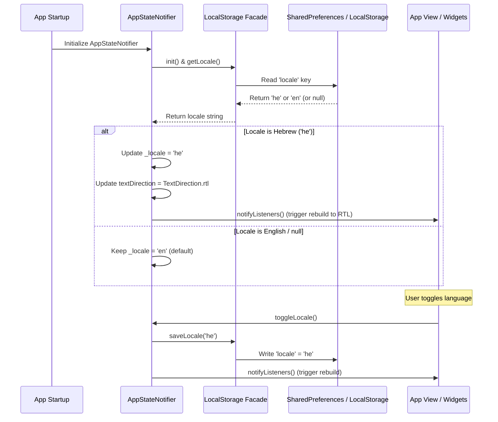

# Technical Design Document: Save User Language Selection (Issue #100)

## 1. Architectural Summary
This feature integrates persistent language selection using the existing `LocalStorage` architecture. When the application starts, `AppStateNotifier` queries `LocalStorage` asynchronously to retrieve the saved locale. If a value exists (either `'en'` or `'he'`), the notifier updates the locale state and triggers a layout direction rebuild. When a user manually toggles the language, the selected locale is updated both in memory and in the platform's local storage.

## 2. Affected Code & Files
- `[MODIFY]` `client/lib/core/state/local_storage_stub.dart`
- `[MODIFY]` `client/lib/core/state/local_storage_io.dart`
- `[MODIFY]` `client/lib/core/state/local_storage_web.dart`
- `[MODIFY]` `client/lib/core/state/local_storage.dart`
- `[MODIFY]` `client/lib/core/state/app_state.dart`
- `[MODIFY]` `client/test/core/state/app_state_test.dart`

## 3. Data Flow & Schema Design
- **Local Storage Key**: `'locale'` (String).
- **Allowed Values**: `'en'` (English), `'he'` (Hebrew).
- **Fallback Value**: `'en'`.
- **State Management**: Managed inside `AppStateNotifier` (Facade) as `_locale` (String).

## 4. UI/UX Interface Specs
- Changing the locale triggers `notifyListeners()` on `AppStateNotifier`.
- `MaterialApp` rebuilt via `ListenableBuilder` applies the updated locale and `_appState.textDirection` (RTL/LTR).
- No visual or styling elements are modified.

## 5. Potential Performance & Security Impacts
- **Performance**: Reading/writing to local storage is fast. Loading occurs once during startup. No UI thread blocking is expected.
- **Security**: No sensitive user data (PII) is stored. Only the language selection string is persisted.

## 6. Expected API Documentation & Code Comments
All new methods added to `LocalStorageImpl` and `LocalStorage` must be documented with three-slash (`///`) comments:
- `/// Retrieve the saved locale code ('en' or 'he').`
- `/// Save the active locale code ('en' or 'he').`
- `_loadLocale()` inside `AppStateNotifier` will include a comment explaining the asynchronous initialization sequence and listener notification.

## 7. Architecture & Implementation Decisions
- **Async Constructor Pattern**: Since Flutter constructors cannot be async, the asynchronous initialization of SharedPreferences is handled in a separate async method `_loadLocale()` called within `AppStateNotifier`'s constructor. This matches the established pattern used by `AuthNotifier`.
