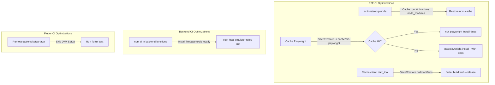

# Technical Design Document: Optimize CI Test Speed (Issue #107)

## 1. Architectural Summary
This optimization aims to reduce CI runtime by implementing caching for dependencies, build artifacts, and browser binaries, and removing redundant execution steps in the workflow configuration.

## 2. Affected Code & Files
- `[MODIFY]` `package.json` (root)
- `[MODIFY]` `backend/functions/package.json`
- `[MODIFY]` `.github/workflows/backend_ci.yml`
- `[MODIFY]` `.github/workflows/e2e_ci.yml`
- `[MODIFY]` `.github/workflows/flutter_ci.yml`

## 3. Caching & Dependency Details
- **NPM Cache**:
  - Cache keys computed from `package-lock.json` and `backend/functions/package-lock.json`.
- **Playwright Browser Cache**:
  - Cache path: `~/.cache/ms-playwright`.
  - Cache key: `${{ runner.os }}-playwright-${{ env.PLAYWRIGHT_VERSION }}`.
- **Flutter Build Cache**:
  - Cache path: `client/.dart_tool`.
  - Cache key: `${{ runner.os }}-flutter-build-${{ hashFiles('client/pubspec.lock') }}-${{ github.run_id }}`.
  - Restore keys allow matching previous runs on the same branch or main.

## 4. Potential Security Impacts
- No security credentials or secrets are cached. Only public node packages, Flutter build files, and open-source browser binaries are preserved in the GitHub Actions runner cache.
