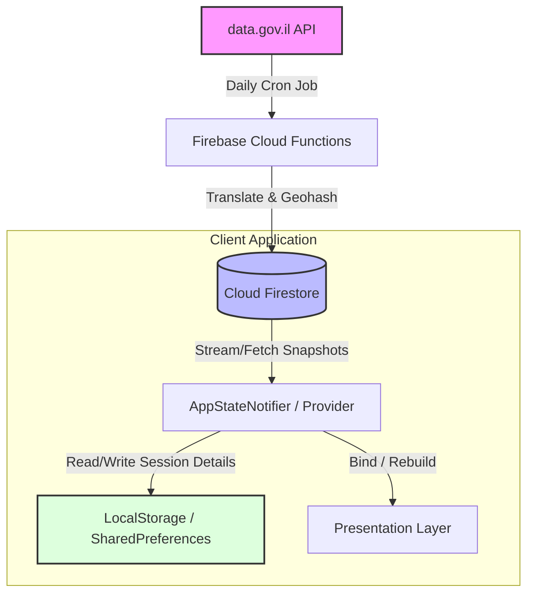
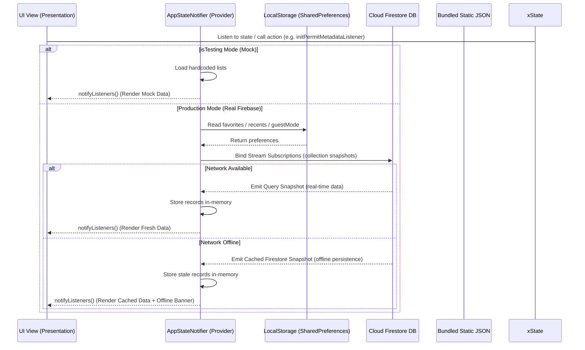
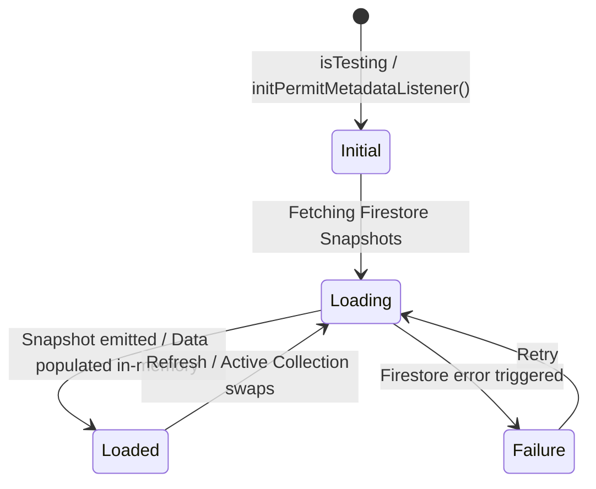

# PlainSightIL: High-Level Architecture & System Boundaries

> [!NOTE]
> **Stitch Integration:**
> *   **Stitch Project Title:** Israel Open Data Explorer
> *   **Stitch Project ID:** `projects/10303868738682079846`
> *   **Stitch Web App:** [stitch.withgoogle.com](https://stitch.withgoogle.com)
> 
> The application design system and screen wireframes are defined and synchronized via Stitch. Developers and automated agents should reference these project resources for UI/UX specifications.

This document establishes the technical architecture, component design, data serialization patterns, and state management conventions for the PlainSightIL application. It serves as the primary ground-truth configuration for automated agents and developers.

---

## 1. Tech Stack & State Management

PlainSightIL utilizes a decoupled client-server architecture. The backend aggregates and structures raw governmental datasets, and the client renders fluid, localized, visual insights.

### 1.1 Client Stack
*   **Framework**: **Flutter (Dart)** compiling to native iOS, Android, and WebAssembly targets.
*   **Rendering Engine**: **Impeller** (forced enablement).
*   **State Management**: **Provider with ChangeNotifier** (specifically `AppStateNotifier`). Coordinates stream subscriptions and notifies UI elements to rebuild on new events.
*   **Client Caching**: **SharedPreferences** (for user settings, guest mode, favorites, and recents) paired with **Cloud Firestore native offline persistence** and in-memory caches.
*   **UI Assets**: Vector rendering with `flutter_svg` and native hardware-accelerated drawing with `CustomPainter`.
*   **Offline Mock Mode**: Managed via the `AppStateNotifier.isTesting` flag. When `true`, it bypasses live Firestore calls and loads local mock lists to enable rapid widget testing and previewing without launching the Firebase emulator suite. Set `isTesting = false` inside `app_state.dart` to connect to local Firebase emulators.

### 1.2 Backend Stack
*   **Platform**: **Firebase & Google Cloud Platform (GCP)**.
*   **Database**: **Cloud Firestore (NoSQL)**. High-performance document storage with spatial indexing (Geohashing) for geographical queries.
*   **Scheduled Scrapers**: **Firebase Cloud Functions** (Node.js/TypeScript). Cron-triggered processes pulling datasets daily from `data.gov.il`.

---

## 2. Data Flow Architecture

Data transitions dynamically from the government source endpoints to client-side renders through distinct sync, transform, and cache layers.



### 2.1 Backend Ingestion Workflow (Daily Sync)
1. **Fetch**: Cloud Functions query the target dataset endpoint via standard HTTP requests.
2. **Translate**: Raw Hebrew API keys are mapped to consistent, camelCase English keys.
3. **Geocode**: Geographic coordinates are converted to Geohash strings (length 9) for localized spatial queries.
4. **Load**: Firestore documents are created or updated.

### 2.2 Client Query & Cache Workflow
1. **Initiate**: The UI listens to or triggers state modifications in the `AppStateNotifier` via the `Provider` pattern.
2. **Check Cache**: The client queries **Cloud Firestore** which natively handles offline persistence.
3. **Preferences / Recents Update**: The app reads and writes user-specific flags (e.g., guest mode, favorites, recents) to **SharedPreferences** via the unified `LocalStorage` wrapper.
4. **Fallback Handling**: If offline and Firebase is not initialized (or in mock testing mode), load bundled fallback static JSON assets directly to ensure the app UI remains functional.

---

## 3. Data Sync Sequence Diagram

The interaction sequence between the client layers and remote/local data sources during viewport requests is illustrated below:



---

## 4. Database Schema Specifications

### 4.0 Ground-Truth Database Schemas (JSON Specification)
Detailed, machine-readable JSON schemas defining properties, types, constraints, and subcollections for all Firestore documents are located in [database_schemas.json](file:///Users/abenzaken/Dev/PlainSightIL/.ai_context/database_schemas.json). AI agents and codebase generators must refer to this file as the database ground-truth.

### 4.1 Cloud Firestore Document Schema Examples

To optimize geo-searches and provide bilingual information, documents use pre-computed structures. Here are examples of the primary collections:

#### Cellular Antennas (`cellular_antennas/{documentId}`)
```json
{
  "id": "CELL-4921A",
  "antennaId": "CELL-4921A",
  "siteNumber": "site-103a",
  "coordinates": {
    "_latitude": 32.0853,
    "_longitude": 34.7818
  },
  "geohash": "svz7rhfb8",
  "operatorName": "Partner",
  "company": {
    "he": "פרטנר",
    "en": "Partner"
  },
  "locality": "תל אביב",
  "permitType": "Active",
  "radiationFrequency": 1800.0,
  "lastTestDate": "2026-05-15T00:00:00Z",
  "addressHebrew": "דיזנגוף 50, תל אביב",
  "addressEnglish": "50 Dizengoff, Tel Aviv",
  "createdAt": "2026-05-15T12:00:00Z",
  "updatedAt": "2026-06-01T22:30:00Z",
  "lastUpdated": "2026-05-15T00:00:00Z"
}
```

#### Cellular Permit Applications (`cellular_permit_applications/{documentId}`)
```json
{
  "id": "1002345",
  "submissionDate": "2026-04-10T00:00:00Z",
  "referenceNumber": 2026041002,
  "company": {
    "he": "סלקום",
    "en": "Cellcom"
  },
  "permitType": "היתר הקמה",
  "siteNumber": "NS-392A",
  "locality": "ירושלים",
  "addressDescription": "גג בית החולים",
  "focalPointType": "גג",
  "coordinates": {
    "_latitude": 31.7719,
    "_longitude": 35.2170
  },
  "geohash": "svz3qyfb8",
  "jurisdiction": "ירושלים",
  "createdAt": "2026-04-10T12:00:00Z",
  "updatedAt": "2026-06-01T22:30:00Z",
  "lastUpdated": "2026-06-01T22:30:00Z"
}
```

#### Companies in Liquidation (`companies_liquidation/{documentId}`)
```json
{
  "id": "514930129",
  "companyId": 514930129,
  "companyName": "טקסטיל בעמ",
  "liquidationCaseId": 930129,
  "caseStatus": {
    "he": "פירוק פעיל",
    "en": "Active Winding Up"
  },
  "submissionDate": "2026-01-15T00:00:00Z",
  "liquidationOrderDate": "2026-03-20T00:00:00Z",
  "cancellationFreezeDate": null,
  "closureDate": null,
  "closureReason": null,
  "districtCourt": "תל אביב",
  "cityOfActivity": "בני ברק",
  "createdAt": "2026-03-20T12:00:00Z",
  "updatedAt": "2026-06-01T22:39:22Z",
  "lastUpdated": "2026-06-01T22:39:22Z"
}
```

#### Doctors Licenses (`doctors_licenses/{documentId}`)
```json
{
  "id": "1",
  "_id": 1,
  "firstName": "מריו ה",
  "lastName": "קורוב",
  "licenseNumber": 4267,
  "licenseRegistrationDate": "1969-07-28T00:00:00Z",
  "specialtyCertificateNumber": null,
  "specialtyRegistrationDate": null,
  "specialtyName": null,
  "createdAt": "2026-05-15T12:00:00Z",
  "updatedAt": "2026-06-02T17:00:00Z",
  "lastUpdated": "1969-07-28T00:00:00Z"
}
```

### 4.2 Client Local Storage Interface (SharedPreferences Wrapper)
The client application persists state flags, user favorites, and recents across restarts using the `SharedPreferences` plugin via a unified, platform-conditional `LocalStorage` interface.

```dart
/// Platform-independent abstract contract for local storage
abstract class LocalStorageImpl {
  Future<void> init();
  List<String> getFavorites();
  Future<void> saveFavorites(List<String> favorites);
  List<String> getRecents();
  Future<void> saveRecents(List<String> recents);
  bool getGuestMode();
  Future<void> saveGuestMode(bool enabled);
  Future<void> clearAll();
  String? getLastSavedBranch();
  Future<void> saveLastSavedBranch(String branch);
}
```

---

## 5. State Management & Data Streaming (Provider)

Business logic and Firestore stream subscriptions are managed via the **Provider** pattern using `ChangeNotifier` to notify widgets of state changes.

### 5.1 State Transitions Diagram



### 5.2 AppStateNotifier Core Interface

```dart
class AppStateNotifier extends ChangeNotifier {
  // Authentication & Settings
  User? _currentUser;
  bool _isGuestMode = false;
  bool _isMockAuthenticated = false;

  // In-Memory Dataset Buffers
  List<Map<String, dynamic>> _permitRecords = [];
  List<Map<String, dynamic>> _antennaRecords = [];
  List<DatasetMetadataModel> _directoryRecords = [];

  // Loading Flags
  bool _isLoadingPermits = true;
  bool _isLoadingAntennas = true;
  bool _isLoadingDirectory = true;

  // Initialize and bind real-time listeners
  void initPermitMetadataListener() {
    // Spawns listeners for all active datasets
    initAntennaListener();
    initDirectoryListener();
    initLiquidationListener();
    initDoctorsListener();
    initAdminMetadataListener();
  }

  // Notifies all listening widgets to rebuild
  void updateState() {
    notifyListeners();
  }
}
```

---

## 6. Architectural Boundaries

Strict file and directory structure isolates framework code from core business rules. This layout facilitates parallel development by separate agents.

### 6.1 Workspace Monorepo Root
*   `client/` - Flutter Native Application.
*   `backend/` - Cloud functions, firestore security rules, deployment configurations.
*   `.ai_context/` - Domain knowledge and architectural guardrails (LLM/agent-readable).
*   `.agents/` - SDLC agent definitions, custom prompts, and workflows.

### 6.2 Client Component Boundaries
Features are modularized under `client/lib/features/[feature_name]/` (or `client/lib/features/datasets/[dataset_name]/`) using a simplified clean architecture structure.

```
client/lib/features/[feature_name]/
│
├── data/                             # Data Layer
│   └── models/                       # JSON serialization/deserialization models
│
└── presentation/                     # Presentation Layer
    ├── pages/                        # Screen views and scaffold containers
    └── widgets/                      # Specific visual cards, bottom drawers, and maps
```

### 6.3 Strict Modularity Rules & State Scoping
*   **Centralized vs Scoped State**: Global states, authentication, and dataset listeners are currently coordinated by the monolithic `AppStateNotifier` in `core/state/app_state.dart`. In the future, this state will be modularized and split into feature-specific scoped Notifiers (e.g. `AntennasNotifier`) placed under their respective presentation layers.
*   **No Cross-Feature Imports**: A feature's internal components (e.g., in `features/datasets/cellular_antennas/`) must never directly import files from another feature (e.g., `features/datasets/companies_liquidation/`). Shared resources and global styling tokens must reside in `client/lib/core/`.
*   **RTL/LTR Geometry Independence**: Absolute horizontal coordinates (e.g., `left` / `right`) are strictly banned in padding, margins, borders, and alignments. All layouts must use relative direction wrappers:
    - Use `AlignmentDirectional` instead of `Alignment`.
    - Use `EdgeInsetsDirectional` instead of `EdgeInsets`.
    - Use `BorderDirectional` instead of `Border`.
    - (Refer to [design.md](file:///Users/abenzaken/Dev/PlainSightIL/docs/design.md) for direct Flutter Dart vs. CSS style rules).

---

## 7. Dataset Integration Pipeline (Developer Checklist)

Every time a developer or agent adds a new dataset to PlainSightIL, they must perform the following actions:

1.  **Define Data Models**: Write matching Dart data serializable models with custom key parsers (in `data/models/`).
2.  **Setup Cloud Data Syncer**: Write a new Cloud Scheduler cron task inside the Firebase Functions codebase to scrape the target dataset from `data.gov.il`, clean/translate key-value structures, compute Geohashes, and write records to Cloud Firestore.
3.  **Define Cloud Index Rules**: Set up index configurations in Firestore (e.g. `geohash ASC + lastUpdated DESC`) for query optimizations.
4.  **Register State Listener**: Add the dataset properties, stream subscriptions, and loader flags to `AppStateNotifier` (or a feature-scoped Notifier), ensuring dynamic updates.
5.  **Create UI Presentation Panels**:
    *   Assemble a visual canvas (e.g. Map with markers, detail lists, custom charts).
    *   Build a detail bottom sheet panel matching collapsed/half/expanded layouts.
    *   Ensure all widgets support logical direction alignments (`Directional` classes).
6.  **Enforce Quality Standards**: Verify that the code follows all conventions and passes all test coverage specifications outlined in [coding_standards.md](file:///Users/abenzaken/Dev/PlainSightIL/.ai_context/coding_standards.md).
