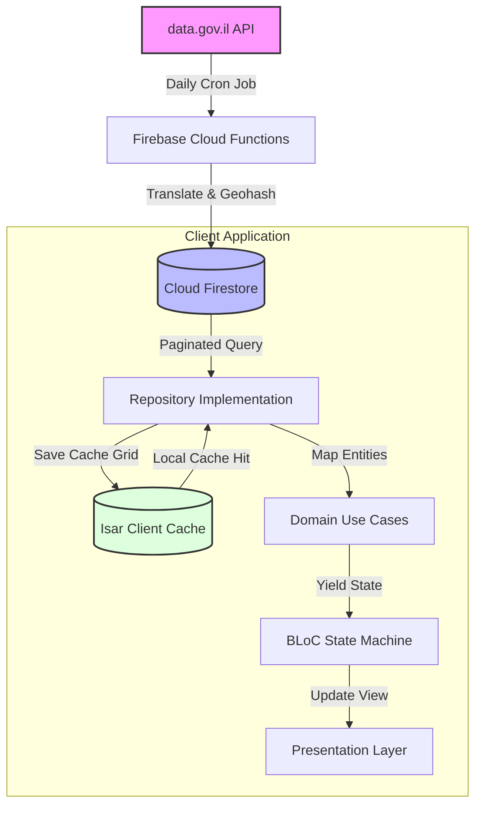
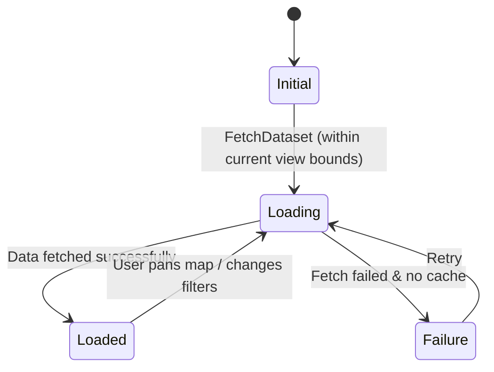

# PlainSightIL: High-Level Architecture & System Boundaries

> [!NOTE]
> **Stitch Integration:**
> *   **Stitch Project Title:** Israel Open Data Explorer
> *   **Stitch Project ID:** `projects/10303868738682079846`
> *   **Stitch Web App:** [stitch.withgoogle.com](https://stitch.withgoogle.com)
> 
> The application design system and screen wireframes are defined and synchronized via Stitch. Developers and automated agents should reference these project resources for UI/UX specifications.

This document establishes the technical architecture, component design, data serialization patterns, and domain isolation boundaries for the PlainSightIL application. It serves as the primary ground-truth configuration for automated agents and developers.

---

## 1. Tech Stack & State Management

PlainSightIL utilizes a decoupled client-server architecture. The backend aggregates and structures raw governmental datasets, and the client renders fluid, localized, visual insights.

### 1.1 Client Stack
*   **Framework**: **Flutter (Dart)** compiling to native iOS, Android, and WebAssembly targets.
*   **Rendering Engine**: **Impeller** (forced enablement).
*   **State Management**: **BLoC (Business Logic Component)**. Ensures unidirectional data flow, separating UI events from business logic. No business logic in presentation files.
*   **Client Caching**: **Isar Database (NoSQL)**. Local query caching to allow offline operation and near-instant load times without syncing the complete database.
*   **UI Assets**: Vector rendering with `flutter_svg` and native hardware-accelerated drawing with `CustomPainter`.

### 1.2 Backend Stack
*   **Platform**: **Firebase & Google Cloud Platform (GCP)**.
*   **Database**: **Cloud Firestore (NoSQL)**. High-performance document storage with spatial indexing (Geohashing) for geographical queries.
*   **Scheduled Scrapers**: **Firebase Cloud Functions** (Node.js/TypeScript). Cron-triggered processes pulling datasets daily from `data.gov.il`.

---

## 2. Data Flow Architecture

Data transitions dynamically from the government source endpoints to client-side renders through distinct sync, transform, and cache layers.



### 2.1 Backend Ingestion Workflow (Daily Sync)
1. **Fetch**: Cloud Functions query the target dataset endpoint via standard HTTP requests.
2. **Translate**: Raw Hebrew API keys are mapped to consistent, camelCase English keys.
3. **Geocode**: Geographic coordinates are converted to Geohash strings (length 9) for localized spatial queries.
4. **Load**: Firestore documents are created or updated.

### 2.2 Client Query & Cache Workflow
1. **Initiate**: The UI invokes a use case via a BLoC event (e.g., `FetchAntennasInViewport`).
2. **Check Cache**: The repository queries **Isar DB** for matching cached grids within the last 2 hours.
    - *Cache Hit*: Read local records instantly. Yield state.
    - *Cache Miss*: Fetch paginated geo-range snapshots from **Firestore**.
3. **Cache Update**: Write remote records to **Isar DB** with a fresh timestamp.
4. **Fallback Handling**: If offline and no local cache is found, load bundled fallback static JSON assets to ensure the app UI remains functional.

---

## 3. Data Sync Sequence Diagram

The interaction sequence between the client layers and remote/local data sources during viewport requests is illustrated below:

```mermaid
sequenceDiagram
    participant UI as Presentation Layer (UI)
    participant Repo as Repository Implementation
    participant Local as Local Client Cache (Isar)
    participant Firestore as Cloud Firestore DB
    participant LocalAssets as Bundled Fallback JSON

    UI->>Repo: FetchTowersInRadius(lat, lng, radius)
    Repo->>Local: CheckCachedQueryResults(lat, lng, radius)
    alt Cache hit and fresh (< 2 hours)
        Local-->>Repo: Return Cached subset
        Repo-->>UI: Deliver Data (Instant Render)
    else Cache miss / expired
        Repo->>Firestore: Fetch documents in geohash bounds (paginated)
        alt Network Success
            Firestore-->>Repo: Return Document Snapshots
            Repo->>Local: Store query result subset + timestamp
            Repo-->>UI: Deliver Clean Data
        alt Network Failure / Offline
            Repo->>Local: CheckCachedQueryResults(lat, lng, radius) (any status)
            alt Local cache exists
                Local-->>Repo: Return Stale Cache
                Repo-->>UI: Deliver Data + Stale warning
            else No cache exists
                Repo->>LocalAssets: Load static mock JSON (bundled)
                LocalAssets-->>Repo: Return mock data
                Repo-->>UI: Deliver Mock Data + Offline Banner
            end
        end
    end
```

---

## 4. Database Schema Specifications

### 4.1 Cloud Firestore Document Schema (`cellular_antennas/{documentId}`)
To optimize geo-searches, documents use Firestore geopoints and pre-computed geohashes:

```json
{
  "antennaId": "CELL-4921A",
  "coordinates": {
    "_latitude": 32.0853,
    "_longitude": 34.7818
  },
  "geohash": "svz7rhfb8",
  "operatorName": "Partner",
  "permitType": "Active",
  "radiationFrequency": 1800.0,
  "lastTestDate": "2026-05-15T00:00:00Z",
  "addressHebrew": "דיזנגוף 50, תל אביב",
  "addressEnglish": "50 Dizengoff, Tel Aviv"
}
```

### 4.2 Client Isar Database Model (Cached Query Ranges)
The client application caches previously retrieved coordinate grids to speed up map panning.

```dart
@collection
class CachedGeoQuery {
  Id id = Isar.autoIncrement;

  @Index(type: IndexType.value)
  final String queryHash; // Hashed value of lat/lng rounded to 3 decimal places + radius

  final DateTime cachedAt;
  final List<String> antennaDocumentIds;

  CachedGeoQuery({
    required this.queryHash,
    required this.cachedAt,
    required this.antennaDocumentIds,
  });
}
```

---

## 5. Unidirectional State Management (BLoC)

Business logic is managed via **BLoC**. The state of each dataset module transitions deterministically based on incoming user events.

### 5.1 State Transitions Diagram



### 5.2 Example Bloc Interface

```dart
// Events
abstract class AntennaEvent {}
class FetchAntennasInViewport extends AntennaEvent {
  final double centerLatitude;
  final double centerLongitude;
  final double radiusInMeters;
  FetchAntennasInViewport({
    required this.centerLatitude,
    required this.centerLongitude,
    required this.radiusInMeters,
  });
}

// States
abstract class AntennaState {}
class AntennaInitial extends AntennaState {}
class AntennaLoading extends AntennaState {}
class AntennaLoaded extends AntennaState {
  final List<CellularAntenna> visibleAntennas;
  final bool isFromOfflineCache;
  AntennaLoaded({required this.visibleAntennas, required this.isFromOfflineCache});
}
class AntennaFailure extends AntennaState {
  final String message;
  AntennaFailure(this.message);
}
```

---

## 6. Architectural Boundaries

Strict file and directory structure isolates framework code from core business rules. This layout facilitates parallel development by separate agents.

### 6.1 Workspace Monorepo Root
*   `client/` - Flutter Native Application.
*   `backend/` - Cloud functions, firestore security rules, deployment configurations.
*   `.ai_context/` - Domain knowledge and architectural guardrails (LLM/agent-readable).
*   `.agents/` - SDLC agent definitions, custom prompts, and workflows.

### 6.2 Client Component Boundaries
Features are modularized under `client/lib/features/[feature_name]/` and must implement **Clean Architecture**:

```
client/lib/features/[feature_name]/
│
├── data/                             # Data Layer (Depends on Domain)
│   ├── datasources/                  # Remote Firestore SDK & Local Isar DB wrappers
│   ├── models/                       # JSON serialization/deserialization classes
│   └── repositories/                 # Repository implementations coordinating remote/local data
│
├── domain/                           # Domain Layer (Pure Dart, No External UI/DB Dependencies)
│   ├── entities/                     # Plain Dart models for core business objects
│   ├── repositories/                 # Abstract contracts specifying data interfaces
│   └── usecases/                     # Specific application business flow controllers
│
└── presentation/                     # Presentation Layer (Depends on Domain)
    ├── blocs/                        # BLoC / Cubit state managers
    ├── pages/                        # Screen layouts and routing anchors
    └── widgets/                      # Specific visual elements, bottom sheets, maps
```

### 6.3 Strict Modularity Rules
*   **Dependency Direction**: Data and Presentation layers depend on the Domain layer. The Domain layer must **never** depend on external packages, UI frameworks, databases, or state management frameworks.
*   **No Cross-Feature Imports**: A feature's internal components (e.g., in `features/cellular_antennas/`) must never directly import files from another feature (e.g., `features/water_level/`). Shared services must reside in `client/lib/core/`.
*   **RTL/LTR Geometry Independence**: Absolute horizontal coordinates (e.g., `left` / `right`) are strictly banned in padding, margins, borders, and alignments. All layouts must use relative direction wrappers:
    - Use `AlignmentDirectional` instead of `Alignment`.
    - Use `EdgeInsetsDirectional` instead of `EdgeInsets`.
    - Use `BorderDirectional` instead of `Border`.
    - (Refer to [design.md](file:///Users/abenzaken/Dev/PlainSightIL/docs/design.md) for direct Flutter Dart vs. CSS style rules).

---

## 7. Dataset Integration Pipeline (Developer Checklist)

Every time a developer or agent adds a new dataset to PlainSightIL, they must perform the following actions:

1.  **Define Entities & Models**: Write clean Dart entities representing the logical business entity (in `domain/entities`), and matching data serializable models with custom key parsers (in `data/models`).
2.  **Setup Cloud Data Syncer**: Write a new Cloud Scheduler cron task inside the Firebase Functions codebase to scrape the target dataset from `data.gov.il`, clean/translate key value structures, compute Geohashes, and write records to Cloud Firestore.
3.  **Define Cloud Index Rules**: Set up compound index configurations in Firestore (e.g. `geohash ASC + permitType ASC`) for query optimizations.
4.  **Create Client Repositories & Usecases**: Write client data querying layer to fetch paginated boundaries, write subsets locally to Isar, and map results to clean structures.
5.  **Build BLoC Events & States**: Establish logical data flows.
6.  **Create UI Presentation Panels**:
    *   Assemble a visual canvas (e.g. Map, concentric circular gauge, SVG chart).
    *   Build a bottom sheet panel mapping to collapsed/half/expanded layouts.
    *   Ensure all widgets support logical alignments (`Directional` classes).
7.  **Enforce Quality Standards**: Verify that the code follows all conventions and passes all test coverage specifications outlined in [coding_standards.md](file:///Users/abenzaken/Dev/PlainSightIL/.ai_context/coding_standards.md).
