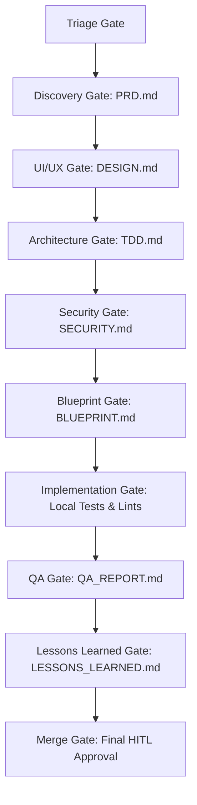

# PlainSightIL: Quality Gates Specification

This document defines the official **Quality Gates** for the PlainSightIL workspace. Quality gates are criteria that code, designs, and documentation must satisfy before transitioning between SDLC phases or before code is merged into the main development branch. 

These gates ensure consistency, security, and high performance across the **Flutter client** and **Firebase/TypeScript backend**.

---

## 1. Quality Gates Governance

Every task (Feature, Bug, Refactor) moves through a structured sequence governed by the Multi-Agent Orchestration Framework (`AGENTS.md`). No task can bypass a gate without meeting the explicit checklist items.

---

## 2. Phase-Specific Quality Gates (Multi-Agent Deliverables)

### 2.1 Discovery Gate (PM Deliverable)
*   **Gatekeeper**: Product Manager Agent
*   **Required Deliverable**: `PRD.md` (Product Requirements Document)
*   **Checklist Criteria**:
    *   [ ] Clear business vision and objective mapped to the core mission.
    *   [ ] Explicitly listed functional requirements (tagged with unique IDs, e.g., `FR-01`, `FR-02`).
    *   [ ] Non-functional requirements (e.g., target loading time, offline synchronization constraints).
    *   [ ] Dataset definition, specifying source tables from data.gov.il and mapped schema formats.
    *   [ ] **HITL Gate**: User sign-off is required on `PRD.md` before moving to design.

### 2.2 UI/UX Design Gate (Designer Deliverable)
*   **Gatekeeper**: UI/UX Designer Agent
*   **Required Deliverable**: `DESIGN.md` (Design Specification)
*   **Checklist Criteria**:
    *   [ ] Full layout mapping for mobile and tablet form factors.
    *   [ ] Precise HSL color codes used exclusively from the designated project palette.
    *   [ ] Visual representations of different component states (loading, loaded, empty, error/no-connection).
    *   [ ] Definitions for custom micro-animations (transitions, skeleton loaders, button hovers).
    *   [ ] **HITL Gate**: User sign-off is required on the UX layout framework before technical architecture starts.

### 2.3 Architecture Design Gate (Architect Deliverable)
*   **Gatekeeper**: System Architect Agent
*   **Required Deliverable**: `TDD.md` (Technical Design Document)
*   **Checklist Criteria**:
    *   [ ] Component hierarchy diagrams mapping Flutter widgets and Clean Architecture layers.
    *   [ ] Backend changes outlined (new Cloud Functions, Firestore schema updates, or SQL tables).
    *   [ ] Explicit data sync caching flow detailed (Isar local DB schema vs Firestore updates).
    *   [ ] Identification of critical third-party dependencies or APIs to be introduced.
    *   [ ] **Expected API Documentation**: Expected API documentation targets (critical classes, interfaces, data mappings, calculations) are declared in `TDD.md`.

### 2.4 Security Gate (Security Engineer Deliverable)
*   **Gatekeeper**: Security Engineer Agent
*   **Required Deliverable**: `SECURITY.md` (Security Audit Report)
*   **Checklist Criteria**:
    *   [ ] Firestore Rules modification plan vetted (no wildcard read/write access allowed).
    *   [ ] API key management strategy confirmed (keys stored in secure config, never hardcoded).
    *   [ ] Threat model identified for any newly exposed Cloud Functions.
    *   [ ] **HITL Gate**: Security & Architecture sign-off is mandatory to unlock developer blueprinting.

### 2.5 Blueprinting Gate (Tech Lead Deliverable)
*   **Gatekeeper**: Technical Lead Agent
*   **Required Deliverable**: `BLUEPRINT.md` (Implementation Checklist)
*   **Checklist Criteria**:
    *   [ ] File modification breakdown listing precisely which files will be created/edited.
    *   [ ] Detailed, step-by-step instructions for implementation to minimize developer context drift.
    *   [ ] Clear mapping of who owns each step (dependencies resolved).
    *   [ ] **Documentation Targets**: Clear checklist items defined for in-code API documentation targets (triple-slash for Dart/Flutter, JSDoc for TypeScript/Node).

### 2.6 Implementation Gate (Developer Deliverable)
*   **Gatekeeper**: Senior Developer Agent
*   **Checklist Criteria**:
    *   [ ] All checklist items in `BLUEPRINT.md` are marked completed.
    *   [ ] Local testing is successful (unit tests and linting pass).
    *   [ ] No compilation warnings or formatting violations left in the modified files.
    *   [ ] **In-Code Documentation**: All new/modified public classes, methods, constructors, and modules conform to the documentation guidelines in `coding_standards.md` (descriptions, parameters, return types, complex logic explanations).

### 2.7 QA Validation Gate (QA Engineer Deliverable)
*   **Gatekeeper**: QA Engineer Agent
*   **Required Deliverable**: `QA_REPORT.md` (QA Validation Report)
*   **Checklist Criteria**:
    *   [ ] Execution matrix mapping all functional requirements to specific test cases (happy/unhappy paths).
    *   [ ] Verification of layout responsiveness across mobile and tablet viewports.
    *   [ ] Accessibility auditing (screen readers, color contrast, tap target sizing).
    *   [ ] Zero open blocker or high-severity defects.
    *   [ ] Regression audit completed on adjacent system features.
    *   [ ] **Documentation Audit**: QA has verified that all new public interfaces and methods contain valid doc comments, and no leftover raw comments or placeholder text exist.

### 2.8 Lessons Learned Gate (Lessons Learned Deliverable)
*   **Gatekeeper**: Lessons Learned Agent
*   **Required Deliverable**: `LESSONS_LEARNED.md` (Lessons Learned Report)
*   **Checklist Criteria**:
    *   [ ] Structured report summarizing the cycle's pitfalls, resolution steps, and preventative guidelines.
    *   [ ] Required playbook or coding standard updates applied to prevent documented pitfalls.
    *   [ ] Implemented code review completed, with remaining minor formatting, lint warnings, or style cleanup refactored.
    *   [ ] **Documentation Cleanup**: In-code documentation audit complete; missing comments or docstrings on all new modules have been fully resolved.

### 2.9 Merge Approval Gate (Coordinator Gate)
*   **Gatekeeper**: Coordinator Agent
*   **Checklist Criteria**:
    *   [ ] All preceding phase artifacts are present and fully filled out.
    *   [ ] Automated CI/CD check run finishes successfully on the branch.
    *   [ ] **HITL Gate**: Manual user merge approval.

---

## 3. Technical Quality Gates (Automated & CI/CD Checks)

These quality gates are executed automatically via local prep scripts and git hooks, and validated in remote CI runners upon Pull Request submission.

### 3.1 Static Analysis and Linting Rules
Static analysis checks verify code quality before tests run.

| Target | Command | Failure Trigger |
| :--- | :--- | :--- |
| **Client (Dart)** | `dart format --set-exit-if-changed .` | Any unformatted file (line length > 80 chars) |
| **Client (Dart)** | `flutter analyze` | Any linting warn/info/error in `analysis_options.yaml` |
| **Backend (TS)** | `npm run lint` | Any ESLint warning or TypeScript compilation error |
| **Backend (TS)** | `npm run format:check` | Any code style deviation from `.prettierrc` |

### 3.2 Automated Test & Coverage Standards
Testing gates protect critical layers of the app from regression.

*   **Coverage Thresholds**:
    *   **Domain & Data Layers (Client & Backend)**: **90%+** unit test coverage.
    *   **Presentation Layer (Client - BLoC/Cubit)**: **100%** flow coverage (all states and events tested).
*   **Execution Rules**:
    *   **Client Command**: `flutter test --coverage` (verified against local LCOV file).
    *   **Backend Command**: `npm run test` (executed via Vitest).
    *   **Integration Tests**: `flutter drive --target=test_driver/app.dart` must pass successfully.

---

## 4. Manual & Experiential QA Gates (Human-in-the-Loop)

These checks are performed by the QA Engineer (using devtools/emulators) to capture visual and experiential bugs that automated tests cannot easily detect.

### 4.1 Device Geometry & Viewport Matrix
Layouts must look premium and flow naturally without text truncation or overflow lines on:
*   **Compact Mobile (SE/Mini)**: 375x667 viewport.
*   **Standard Mobile (iPhone Pro/Pixel)**: 393x852 viewport.
*   **Tablet Landscape/Portrait (iPad Air/Pro)**: 820x1180 viewport.
*   **Safe Areas**: Ensure content respects status bar, notch, and software home indicator offsets.

### 4.2 Localization & RTL Layout Verification
PlainSightIL is designed for Israeli citizens, making RTL (Right-to-Left) Hebrew support crucial:
*   **Layout Swapping**: Icons, labels, alignments, and navigation drawer slides must mirror properly in RTL.
*   **Fonts**: The Outfit/Inter/Roboto Hebrew characters must render correctly with appropriate line height (no overlapping descenders).
*   **Bidi Text**: Text containing mixed languages (e.g., Hebrew dataset names with English status codes) must display in correct order.

### 4.3 Experiential States Checklist
Every view must have defined logic for:
*   **Empty State**: When no data matches filters (must have a clear visual and button/action).
*   **Offline/No Network State**: Clear snackbar/banner, keeping previously cached data visible.
*   **Slow Network State**: Display beautiful skeleton loading frames, matching the geometry of content.
*   **Failed API Fetch State**: A friendly error description with a "Retry" CTA button.

---

## 5. Staging & Release Gates

Before a build can be tagged for production release:

1.  **Firebase Emulator Verification**:
    *   The backend Cloud Functions and Security Rules must run successfully in the local Firebase Emulator Suite.
2.  **Performance Metrics (LCP / App Initialization)**:
    *   **Time to Interactive (TTI)**: Less than **1.5 seconds** on modern mobile devices.
    *   **Frame Rendering**: Avoid jank (no dropped frames during scroll operations; keep rendering at 60/120fps).
3.  **Crash Logs Audit**:
    *   A review of the dev environment console and Firebase Crashlytics shows 0 active crash events or unhandled exceptions.
