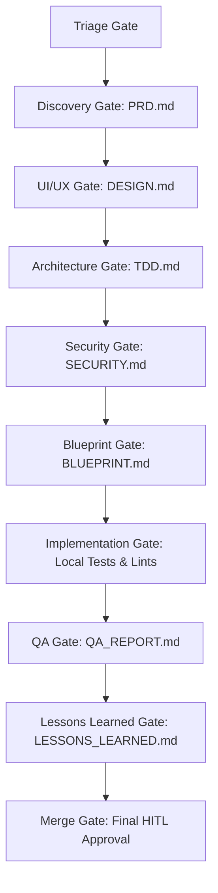

# Contributing to PlainSightIL

Welcome! This guide outlines how **Human Developers** and **Autonomous AI Agents** collaborate on the **PlainSightIL** codebase. 

PlainSightIL aims to transform raw public records from the Israeli government open data portal ([data.gov.il](https://data.gov.il/)) into clean, visual, and highly accessible utilities for mobile and tablet platforms. To maintain the highest engineering standards, all contributors must strictly adhere to the project's custom Multi-Agent SDLC, coding guidelines, and automated quality gates.

---

## 📂 Project Architecture & Directory Structure

Ensure you are working in the correct directories for changes:

*   **[`/client`](file:///Users/abenzaken/Dev/PlainSightIL/client)**: The frontend Flutter/Dart mobile and tablet application.
*   **[`/backend`](file:///Users/abenzaken/Dev/PlainSightIL/backend)**: The Firebase configuration files, security rules, indexes, and Cloud Functions.
*   **[`/.agents`](file:///Users/abenzaken/Dev/PlainSightIL/.agents)**: Multi-agent orchestration roles, playbooks, active issue states, and tooling.
*   **[`/.ai_context`](file:///Users/abenzaken/Dev/PlainSightIL/.ai_context)**: Codebase context files containing system architecture, coding standards, and quality gates.
*   **[`/design`](file:///Users/abenzaken/Dev/PlainSightIL/design)**: Visual assets, UI designs, mockups, and style definitions.
*   **[`/docs`](file:///Users/abenzaken/Dev/PlainSightIL/docs)**: Strategic product documents, including the Vision & Mission and Product Roadmap.

---

## 🛠️ Development Environment Setup

Before starting development, ensure you have the appropriate runtimes and SDKs installed.

### 📱 Client (Flutter & Dart)

*   **SDK Requirement**: Flutter SDK `^3.12.0` (Dart `^3.0.0`).
*   **Install Dependencies**:
    ```bash
    cd client
    flutter pub get
    ```
*   **Verify Setup & Lints**:
    ```bash
    flutter analyze
    ```
*   **Code Formatting**:
    ```bash
    # Verify formatting (fails if formatting is required)
    dart format --set-exit-if-changed .
    
    # Automatically apply formatting
    dart format .
    ```
*   **Running Tests**:
    ```bash
    # Run all unit and widget tests
    flutter test
    
    # Run tests with coverage output
    flutter test --coverage
    ```

### ☁️ Backend (Firebase & TypeScript)

*   **SDK Requirement**: Node.js `v20.x` and Firebase CLI.
*   **Install Dependencies**:
    ```bash
    cd backend/functions
    npm install
    ```
*   **Verify Setup & Lints**:
    ```bash
    # Run ESLint checking
    npm run lint
    
    # Check formatting with Prettier
    npm run format:check
    
    # Apply formatting
    npm run format
    
    # Build TypeScript code
    npm run build
    ```
*   **Running Tests**:
    ```bash
    # Execute backend unit tests using Vitest
    npm run test
    ```
*   **Local Emulation**:
    ```bash
    # Run build and start the local Firebase Emulator Suite
    npm run serve
    ```

### 🛡️ Git Hooks (SDLC Enforcement)

To automate SDLC checks and ensure code health, PlainSightIL utilizes local Git hooks:
*   **pre-commit hook**: Validates that commits are not made directly to `main` or `dev` branches, that branch names follow the pattern `agents/<issue_id>-<desc>` or `dev/<issue_id>-<desc>`, and that a corresponding active issue file exists with `status: in-progress` or `status: blueprint-revision`.
*   **pre-push hook**: Automatically runs lints, formatting checks, and unit tests locally before pushing code, matching the files modified (client and/or backend).

To install these hooks in your local environment, run:
```bash
chmod +x .agents/bin/install-hooks.sh
./.agents/bin/install-hooks.sh
```

---

## 🔄 Multi-Agent SDLC & Issue Tracking

PlainSightIL implements a strict, phase-gated Multi-Agent SDLC Orchestration. Every issue (Feature, Bug, Refactor) transitions through specified stages. AI Agents are assigned to individual phases and submit output artifacts to move issues forward.

> [!IMPORTANT]
> No file changes may be implemented without an active issue tracked in **[`/.agents/state/active_issues/`](file:///Users/abenzaken/Dev/PlainSightIL/.agents/state/active_issues)**.



### 1. Active Issue States
Each task is tracked in an issue markdown file: `/.agents/state/active_issues/issue_<issue_id>.md`.
The file frontmatter contains the current metadata state:

```yaml
---
issue_id: 1
title: "Implement Navigation Menu Drawer"
type: feature
current_phase: merge_approval
assigned_agent: coordinator
status: completed
hitl_approval_required: true
hitl_approved_by: "abenzaken"
---
```

### 2. Phase-Specific Deliverables
As issues move through the lifecycle, the following files are produced and saved in `/.agents/state/issue_<issue_id>/`:
*   **Discovery**: `PRD.md` (Product Requirements Document)
*   **UI/UX Design**: `DESIGN.md` (Design Specification)
*   **Architecture**: `TDD.md` (Technical Design Document)
*   **Security Audit**: `SECURITY.md` (Security Audit Report)
*   **Blueprinting**: `BLUEPRINT.md` (Implementation Checklist & Steps)
*   **QA Validation**: `QA_REPORT.md` (Test Cases, Viewports, and Accessibility validations)
*   **Lessons Learned**: `LESSONS_LEARNED.md` (Lessons Learned Report containing pitfalls and updates)

---

## 🤖 Guidelines for AI Agents

As an autonomous AI agent working in this repository, you must behave as a disciplined software engineer:

1.  **Read Context First**: Before editing files, always read the metadata and rule sets in **[`/.ai_context/`](file:///Users/abenzaken/Dev/PlainSightIL/.ai_context)**:
    *   [Architecture](file:///Users/abenzaken/Dev/PlainSightIL/.ai_context/architecture.md)
    *   [Coding Standards](file:///Users/abenzaken/Dev/PlainSightIL/.ai_context/coding_standards.md)
    *   [Quality Gates](file:///Users/abenzaken/Dev/PlainSightIL/.ai_context/quality_gates.md)
2.  **Use Git Correctly**:
    *   Checkout branches using the prefix format: `agents/<issue_id>-<short-description>`.
    *   Always verify your modifications locally before requesting reviews.
3.  **Adhere to Planning Mode**:
    *   When a non-trivial change starts, produce a `development_plan.md` or update the workspace's implementation plans.
    *   Maintain a `task.md` TODO checklist, marking progress sequentially (`[ ]` to `[/]` to `[x]`).
    *   Produce a `walkthrough.md` file summarizing completed tasks when submitting code.
4.  **Log Transitions**:
    *   Whenever you finish your assigned phase, edit the active issue file (`/.agents/state/active_issues/issue_<id>.md`).
    *   Append your transition log to the `## 📋 Audit Log & Stage Transitions` section.
    *   Update the frontmatter to indicate the next phase and the next assigned agent role.

---

## 🧑‍💻 Guidelines for Human Contributors & Reviewers

Human developers play a critical role in governance, validation, and merge approval:

1.  **Human-in-the-Loop (HITL) Gates**:
    *   Certain transitions (e.g., Discovery `PRD.md` sign-off, Security approval, and final QA Validation) require a human's review.
    *   To sign off on a gate, review the agent's work, then set the frontmatter parameter `hitl_approved_by` to your username:
        ```yaml
        hitl_approved_by: "your_username"
        ```
2.  **Pull Request Reviews**:
    *   Verify that agents have provided all required design, architecture, and security reports.
    *   Run client and backend tests locally before merging.
3.  **Manual & Experiential Testing**:
    *   Verify Right-to-Left (RTL) localization for Hebrew text, ensuring layout items flip correctly.
    *   Verify responsiveness using Chrome DevTools or mobile simulators across device profiles:
        *   Compact Mobile: 375x667 viewport
        *   Standard Mobile: 393x852 viewport
        *   Tablet: 820x1180 viewport
    *   Perform a visual review of micro-animations, skeleton loaders, and HSL color compliance.

---

## 🎨 Code Quality & Styling Standards

All contributions must follow these key design and coding rules:

*   **Visual Style**: Standard Tailwind CSS or plain CSS layouts should feature rich aesthetics, including dark mode capability, clean glassmorphism (`backdrop-filter`), curated HSL color schemes, and Outfit/Inter/Roboto Hebrew fonts.
*   **Architecture**: Keep a strict separation of layers:
    *   **Domain**: Models, Value Objects, Use Cases, and Repositories interfaces.
    *   **Data**: Data Sources (Firestore/HTTP), Repository Implementations, Caching (Isar).
    *   **Presentation**: BLoC/Cubit states, UI Widgets, Screen layouts.
*   **Error Handling**: Data layers throw exceptions (`ServerException`, `CacheException`). Repositories catch them and return functional container types (`Either<Failure, Success>`).
*   **Test Coverage**: Domain/Data layers must retain **90%+** unit test coverage. Cubits/BLoCs require **100%** event-to-state flow coverage.
*   **In-Code Documentation**: All contributions must comply with the standard documentation rules defined in [coding_standards.md](file:///Users/abenzaken/Dev/PlainSightIL/.ai_context/coding_standards.md#5-in-code-documentation-standards). Ensure all new public classes, interfaces, methods, constructors, and functions are documented using three-slash (`///`) comments for Dart/Flutter or JSDoc (`/** ... */`) blocks for TypeScript/Node.js. Include descriptive explanations, parameters, return value details, and inline comments for complex logic/math.
