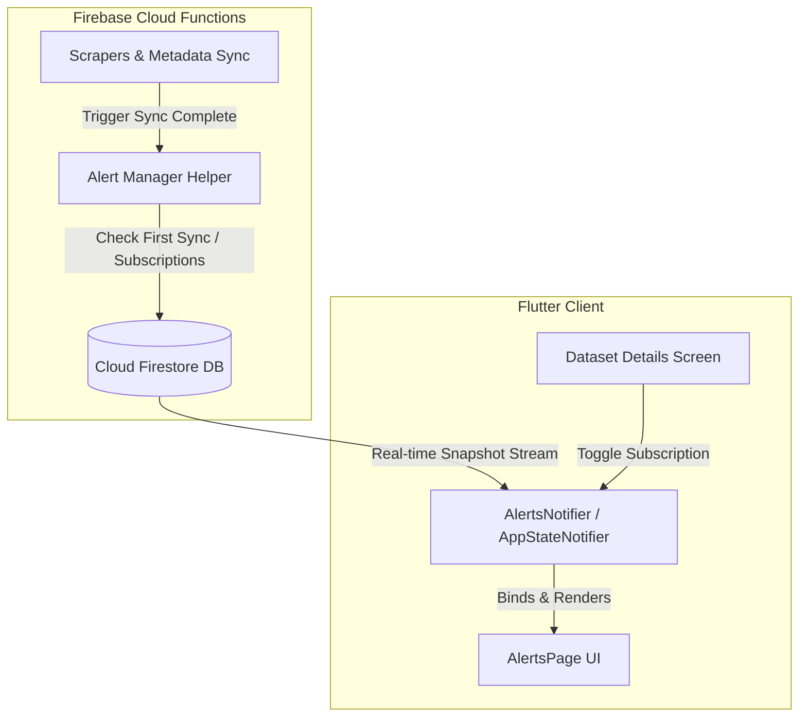

# Technical Design Document: Alerting Feature (Issue #143)

## 1. Architectural Summary

The Alerting Feature coordinates the generation and delivery of in-app notifications to users. It comprises subscription management, backend notification triggers, and a localized real-time notification feed in the client application.



---

## 2. Affected Code & Files

The following files will be modified, created, or deleted:

- `[MODIFY]` [firestore.rules](file:///Users/abenzaken/.gemini/antigravity/worktrees/PlainSightIL/approve-prd-issue-143/backend/firestore.rules) — Add security rules for `/subscriptions` and `/users/{userId}/alerts`.
- `[MODIFY]` [index.ts](file:///Users/abenzaken/.gemini/antigravity/worktrees/PlainSightIL/approve-prd-issue-143/backend/functions/src/index.ts) — Implement alert generator utilities and hook them into scraper completions based on the `changedCount` returned by scrapers.
- `[MODIFY]` [metadata_scraper.ts](file:///Users/abenzaken/.gemini/antigravity/worktrees/PlainSightIL/approve-prd-issue-143/backend/functions/src/scrapers/metadata_scraper.ts) — Load existing directory records, compare using `areRecordsEqual`, and generate alerts when a new government dataset is discovered or when visualizer support transitions to `true`.
- `[MODIFY]` [scrapers](file:///Users/abenzaken/.gemini/antigravity/worktrees/PlainSightIL/approve-prd-issue-143/backend/functions/src/scrapers/) — Update all dataset scraper functions (e.g. cellular antennas, companies liquidation) to count and return `changedCount` (number of records that are new or fail `areRecordsEqual`).
- `[NEW]` [alert_model.dart](file:///Users/abenzaken/.gemini/antigravity/worktrees/PlainSightIL/approve-prd-issue-143/client/lib/features/alerts/data/models/alert_model.dart) — Define serialization model for user notifications.
- `[NEW]` [alerts_notifier.dart](file:///Users/abenzaken/.gemini/antigravity/worktrees/PlainSightIL/approve-prd-issue-143/client/lib/features/alerts/presentation/notifiers/alerts_notifier.dart) — Manage user alert streams, subscription status, and badge states.
- `[NEW]` [alerts_page.dart](file:///Users/abenzaken/.gemini/antigravity/worktrees/PlainSightIL/approve-prd-issue-143/client/lib/features/alerts/presentation/pages/alerts_page.dart) — Build the glassmorphic notifications feed UI.
- `[MODIFY]` [app_state.dart](file:///Users/abenzaken/.gemini/antigravity/worktrees/PlainSightIL/approve-prd-issue-143/client/lib/core/state/app_state.dart) — Register AlertsNotifier and update localization resources.
- `[MODIFY]` [app_shell.dart](file:///Users/abenzaken/.gemini/antigravity/worktrees/PlainSightIL/approve-prd-issue-143/client/lib/core/widgets/app_shell.dart) — Replace the ComingSoon placeholder with AlertsPage and render an unread count badge.
- `[MODIFY]` [navigation_drawer.dart](file:///Users/abenzaken/.gemini/antigravity/worktrees/PlainSightIL/approve-prd-issue-143/client/lib/core/widgets/navigation_drawer.dart) — Update alerts option state to active and display the unread badge.
- `[MODIFY]` [cellular_antennas_page.dart](file:///Users/abenzaken/.gemini/antigravity/worktrees/PlainSightIL/approve-prd-issue-143/client/lib/features/datasets/cellular_antennas/pages/cellular_antennas_page.dart) (and other dataset pages) — Add a bell toggle button to subscribe/unsubscribe from updates.

---

## 3. Data Flow & Schema Design

### 3.1 Firestore Collection: `/subscriptions` (Root Collection)
Persists active user subscriptions to specific datasets.
- **Document ID**: `${userId}_${datasetId}` (guarantees a single subscription document per user-dataset combination).
- **Properties**:
  - `id` (string): Equals `doc.id`.
  - `userId` (string): UID of the subscriber.
  - `datasetId` (string): Identifier of the monitored dataset.
  - `createdAt` (string): ISO 8601 timestamp.

### 3.2 Firestore Collection: `/users/{userId}/alerts` (Private Subcollection)
Stores user-specific notifications.
- **Document ID**: Auto-generated string.
- **Properties**:
  - `id` (string): Equals `doc.id`.
  - `userId` (string): Target user UID.
  - `type` (string): One of `new_dataset`, `new_government_dataset`, `new_records`.
  - `title` (localizedString): Localization map containing `he` and `en` keys.
  - `description` (localizedString): Localization map containing `he` and `en` keys.
  - `datasetId` (string, optional/nullable): Monitored dataset reference if applicable.
  - `recordCount` (integer, optional/nullable): Ingested count for record updates.
  - `isRead` (boolean): Flag representing read status.
  - `createdAt` (string): ISO 8601 timestamp.

### 3.3 Security Rules Design (`firestore.rules`)
- **`/subscriptions/{subscriptionId}`**:
  ```javascript
  match /subscriptions/{subscriptionId} {
    allow read, write: if request.auth != null && (
      (resource == null && request.resource.data.userId == request.auth.uid) ||
      (resource != null && resource.data.userId == request.auth.uid)
    );
  }
  ```
- **`/users/{userId}/alerts/{alertId}`**:
  ```javascript
  match /users/{userId}/alerts/{alertId} {
    allow read, update, delete: if request.auth != null && request.auth.uid == userId;
    allow create: if false; // Writing alerts is restricted to administrative Cloud Functions
  }
  ```

---

## 4. Ingestion Sync & Alert Trigger Logic

### 4.1 Dataset Record Scrapers
During standard dataset sync cycles:
1. Each scraper processes record chunks. For each record, it retrieves the existing document.
2. It evaluates `areRecordsEqual(existingData, incomingData)`.
3. If the record does not exist or has changed (`areRecordsEqual == false`), it is written to the Firestore batch, and `changedCount` is incremented.
4. Upon successful sync execution, the scraper returns `{ success: true, count: totalProcessed, changedCount: changedCount }`.
5. **Alert Condition**: An alert is triggered only if `changedCount > 0` and this sync is NOT the first sync (i.e., `recordCount` was already $>0$ and a previous `lastUpdated` exists in `dataset_metadata`).

### 4.2 Dataset Directory Metadata Scraper
During the `metadata_scraper` sync cycle:
1. The metadata sync processes CKAN packages. It retrieves existing `datasets_metadata` documents in chunks.
2. It evaluates `areRecordsEqual(existingData, incomingData)` to ignore unchanged metadata records.
3. If a dataset metadata record does not exist:
   - It is written to the batch.
   - A `new_government_dataset` broadcast alert is created for all users.
   - If `isSupported == true`, a `new_dataset` broadcast alert is also created.
4. If a dataset metadata record exists but has changed (`areRecordsEqual == false`):
   - It is written to the batch.
   - If `isSupported` transitioned from `false` (or undefined) to `true`, a `new_dataset` broadcast alert is created.
5. **First Sync Guard**: During the initial seeding or first metadata scraper run (when `datasets_metadata` count is 0 or metadata record doesn't exist), all alert generation is bypassed to prevent broadcasting 1200+ alerts.

---

## 5. UI/UX Interface Specs

### 5.1 AlertsPage Page Structure
- **Sign-In CTA (Unauthenticated)**: Render a glassmorphic Card with a bold bell icon, localized message, and a "Sign in with Google" button.
- **Notification Feed (Authenticated)**:
  - Header: Displays "Recent Alerts" (or "התראות אחרונות") and a "Mark all as read" button if unread alerts exist.
  - List View: Scrollable viewport with 80px bottom padding to prevent bottom navigation overlaps.
  - Swipe-to-Dismiss: Wrap alert cards in `Dismissible` widgets configured to detect directionality (dismissing towards the trailing edge).
- **Glassmorphic Card Styling**:
  - Unread Alert: Soft Cyan shadow glow, `rgba(15, 23, 42, 0.85)` background, and 4px border-inline-start in Primary Cyan (`#38bdf8`).
  - Read Alert: Muted border-inline-start (`#3e484f`) and no glow.
  - Tap Gestures: 150ms hover/tap state translation (+4px inline-start).

### 5.2 Subscription Bell Button
- Placed in the AppBar actions of all dataset detail pages next to the Favorites icon.
- Toggling the button when signed out displays a SnackBar prompt to sign in.
- Shows `Icons.notifications_active` (Cyan) when subscribed, and `Icons.notifications_none` (Muted) when unsubscribed.

---

## 6. Potential Performance & Security Impacts

- **Query Pagination**: Alerts stream queries are limited to the 100 most recent items (`limit(100)`) sorted by `createdAt DESC` to prevent client-side performance degradation and high database read volumes.
- **User Isolation**: Security rules prevent users from reading, updating, or deleting notifications belonging to other users.

---

## 7. Expected API Documentation & Code Comments

Public classes (`AlertModel`, `AlertsNotifier`, `AlertsPage`) and public methods (`subscribe`, `unsubscribe`, `markAsRead`, `markAllAsRead`) must contain clear, three-slash (`///`) documentation comments in Dart, detailing parameters, return values, and behavior in mock offline mode. Backend functions must contain JSDoc comments explaining the criteria for skipping alert triggers on first sync.

---

## 8. Architecture & Implementation Decisions

- **Composite Key Constraint**: Subscriptions use `${userId}_${datasetId}` composite keys to enforce unique index requirements and prevent duplicate subscription writes natively.
- **Mock State Support**: To support offline mock modes, `AlertsNotifier` must load simulated alerts and mock subscription lists when `AppStateNotifier.isTesting` is enabled.
