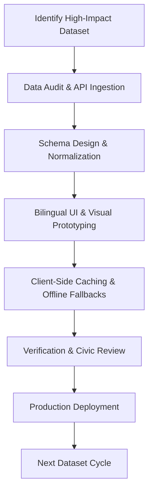

# PlainSightIL: Product Definition Document (PDD)

> [!NOTE]
> **Status:** Draft / Active Review  
> **Author:** Product Manager (Antigravity)  
> **Target Audience:** Engineering, Design, and Civic Stakeholders  
> **Core Philosophy:** *One high-value dataset, perfectly visualized, at a time.*

---

## 1. Executive Summary

**PlainSightIL** is a high-fidelity, mobile-first web application designed to democratize public data in Israel. By extracting dry, obscure, and complex datasets from the official government portal (`data.gov.il`), PlainSightIL translates raw records into clean, interactive, and beautifully designed user interfaces. 

To ensure focus, quality, and momentum, the product will be built using an **incremental dataset rollout strategy**. Rather than launching a massive portal of half-baked features, PlainSightIL will introduce **one dataset at a time**, perfecting the data pipeline, translation, visualization, and mobile UX for each slice before moving to the next.

---

## 2. Strategic Strategy: "One Dataset at a Time" (Incremental Value Delivery)

The traditional approach to open-data portals results in cluttered dashboards, broken links, and overwhelming interfaces. PlainSightIL rejects this in favor of a focused, dataset-centric approach.



### Why this approach?
*   **Quality over Quantity:** Allows us to focus deeply on the unique visualization needs of each dataset (e.g., interactive maps for cellular antennas vs. animated gauge charts for water levels).
*   **Frictionless UX:** Prevents navigation bloat. The app stays lean, loading only what the user needs.
*   **Reliable Data Pipelines:** Government APIs can be unstable. Designing and deploying one pipeline at a time ensures we build robust caching and fallback strategies.
*   **Rapid Feedback Loops:** Users get immediate, production-ready value early, allowing their feedback to shape subsequent dataset rollouts.

---

## 3. Product Vision & Mission Alignment

PlainSightIL's strategic direction, vision, immediate mission, and core operating values (Accessibility, Absolute Neutrality, Trust, and Performance) are defined in the unified **[Vision & Mission Statement](vision_and_mission.md)**. All dataset integrations must align with these founding principles.

---

## 4. Key UX/UI & Technical Principles

Any dataset added to PlainSightIL must conform to these strict architectural and design guidelines:

| Principle | Technical / UI Requirement | Implementation Details |
| :--- | :--- | :--- |
| **Mobile-First Geometry** | Designed primarily for mobile viewports (portrait). | Bottom sheets, swipe gestures, floating action buttons (FABs), and thumb-friendly touch targets (min 48x48px). |
| **Bi-directional Support (RTL/LTR)** | Seamless switching between Hebrew and English. | Flexbox/Grid CSS using logical properties (e.g., `margin-inline-start`) instead of left/right attributes. |
| **State-of-the-Art Aesthetics** | Premium visual appearance that wows users. | Glassmorphism (`backdrop-filter`), tailored HSL-based dark mode colors, smooth micro-animations, and modern typography (e.g., Outfit/Inter). |
| **Offline-First & Speed** | Sub-second load times on poor mobile connections. | LocalStorage/IndexedDB caching of API responses. Graceful mock-data fallbacks if government endpoints are down. |
| **Data Provenance** | Unquestionable accuracy and trust. | Transparent "Data Source" badge displaying the exact agency, API endpoint, and timestamp of the last database refresh. |

---

## 5. Dataset Roadmap & Prioritization Framework

Datasets will be prioritized based on three factors: **Public Demand (Impact)**, **Technical Feasibility**, and **Visualization Suitability**.

### Prioritization Matrix

```
   High  │ ┌──────────────────────────┐    ┌──────────────────────────┐
         │ │                          │    │ ★ Cellular Antennas      │
         │ │                          │    │ ★ Kinneret Water Level   │
         │ │                          │    │                          │
  Public │ └──────────────────────────┘    └──────────────────────────┘
  Demand │
  (Impact)│ ┌──────────────────────────┐    ┌──────────────────────────┐
         │ │                          │    │                          │
         │ │ • Public Budget / Debt   │    │ • Real Estate Sales      │
         │ │                          │    │ • Air Quality / Pollution│
   Low   │ └──────────────────────────┘    └──────────────────────────┘
         └─────────────────────────────────────────────────────────────
           Low                                 High
                      Technical Feasibility & Data Quality
```

---

## 6. Detailed Dataset Rollout Backlog (Initial Launch Target)

Below is the detailed specification for the primary dataset selected for the initial launch.

### 🗼 Target Dataset: Active Cellular Towers & Radiation Permits
*   **Why this dataset?** Very high public utility. Helps citizens check cell towers near their homes or schools, offering immediate interactive map visualization and search capabilities.
*   **The Ingest:** Environmental Protection Ministry dataset of cellular antennas (coordinates, operator, permit type, radiation frequency, and last test date).
*   **The UX Visual:**
    *   Map-centric interface using client-side geolocation.
    *   High-contrast color pins indicating status (Active, Permitted, Under Review).
    *   Radius filters (e.g., "Within 500m of me").
    *   Expandable bottom drawer showing inspection history.

---

## 7. The Ingestion & Visual Workflow (How We Add a Dataset)

Every time we begin a new sprint to add a dataset, the engineering team must follow this recipe:

### Phase A: Data Extraction & Pipeline Audit
1. Query the endpoint on `data.gov.il/api/3/action/datastore_search` to verify active status.
2. Confirm the pagination and search limitations of the endpoint.
3. Define static mock-data fallback templates in JSON format to guarantee client stability.

### Phase B: Translation & Normalization
1. Build a local helper file mapping Hebrew data keys (e.g., `שנת_ייצור`) to clean English keys (e.g., `manufactureYear`).
2. Implement date normalization (handling ISO strings and Hebrew calendar configurations).

### Phase C: UI/UX Implementation
1. Construct the visual cards using semantic HTML5 elements.
2. Implement Tailwind or Vanilla CSS variables for dark/light mode compatibility.
3. Ensure absolute accessibility (`aria-` attributes, keyboard navigation, logical focus order).

### Phase D: Testing & Validation
1. Verify the layout on mobile (Safari/Chrome iOS) and tablet viewports.
2. Audit the site performance using Lighthouse or Chrome DevTools (target LCP < 2.5s, INP < 200ms).

---

## 8. Success Criteria & Metrics

To judge the success of each dataset launch, we will track:
1.  **Usage Depth:** Average session duration and number of searches per user.
2.  **Performance Integrity:** Maintain 95+ Core Web Vitals score on mobile viewports.
3.  **Data Freshness Latency:** Ensure client-cached data is refreshed within 24 hours of a source update.
4.  **Accessibility Compliance:** WCAG 2.1 AA certification.
