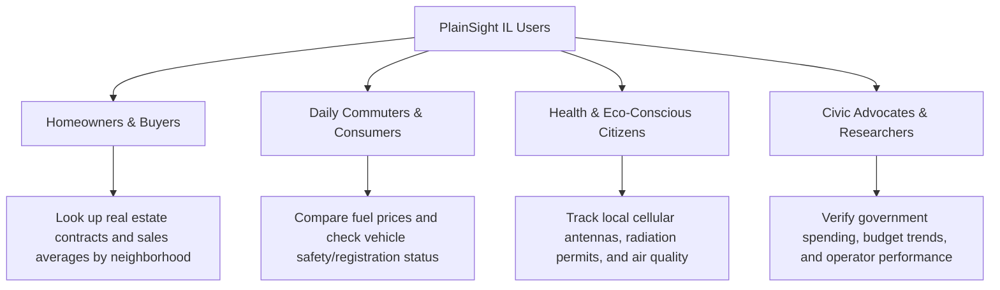

# PlainSight IL: Vision & Mission Statement

> [!NOTE]
> This document serves as the strategic compass for **PlainSight IL**, defining its ultimate long-term goals, immediate mission, and core operating values.

---

## 👁️ The Vision
To create a transparent, data-empowered Israeli society where every citizen has instant, frictionless, and intuitive access to the public information that impacts their daily life.

We envision a future where public datasets are no longer locked behind complex interfaces or obscure databases, but instead serve as a live, clear, and powerful tool in the pocket of every citizen, fostering trust, civic engagement, and informed decision-making.

---

## 🚀 The Mission
To translate the Israeli government's open data into clean, visual, and highly accessible utilities optimized for mobile and tablet devices.

By bridging the gap between raw government databases (`data.gov.il`) and consumer-grade user experiences, **PlainSight IL** empowers citizens to search active cellular towers, track local real estate transactions, monitor environmental metrics, and analyze public spending—all in a bilingual, high-performance, and responsive application.

---

## 💎 Core Values

| Value | Principle | Action in PlainSight IL |
| :--- | :--- | :--- |
| **Accessibility First** | Information is useless if it cannot be easily reached or understood. | We design specifically for mobile and tablet viewports with intuitive RTL/LTR switching and high-contrast typography. |
| **Absolute Neutrality** | Data must speak for itself without political or ideological bias. | We present raw, verified government datasets as-is, letting the numbers and geographic pins tell the objective story. |
| **Trust & Integrity** | High transparency breeds public trust. | We display clear data-provenance labels, showing exactly when the dataset was last updated by the government source. |
| **Performance & Reliability** | Citizen utilities must work when needed, even under poor network conditions. | We implement robust client-side caching and graceful mock-data fallbacks so the app is always fast and responsive. |

---

## 👥 Target Audience & Impact

---

## 🏛️ Strategic Pillars

### 1. Data Democratization & Simplification
Raw CSVs and CKAN APIs are converted into clear charts, maps, and responsive search fields. We focus on visual storytelling—such as showing the Kinneret's water level as an animated liquid card, or cell towers as map coordinates.

### 2. High-Fidelity Mobile Experience
Unlike government portals designed for desktop monitors, PlainSight IL is optimized for thumbs. We design for responsive touch interactions, bottom navigation, and fluid viewport scaling.

### 3. Localization & Inclusivity
We support Hebrew and English, including full RTL (Right-to-Left) formatting. Every citizen—regardless of native language or physical ability—deserves a seamless experience.
